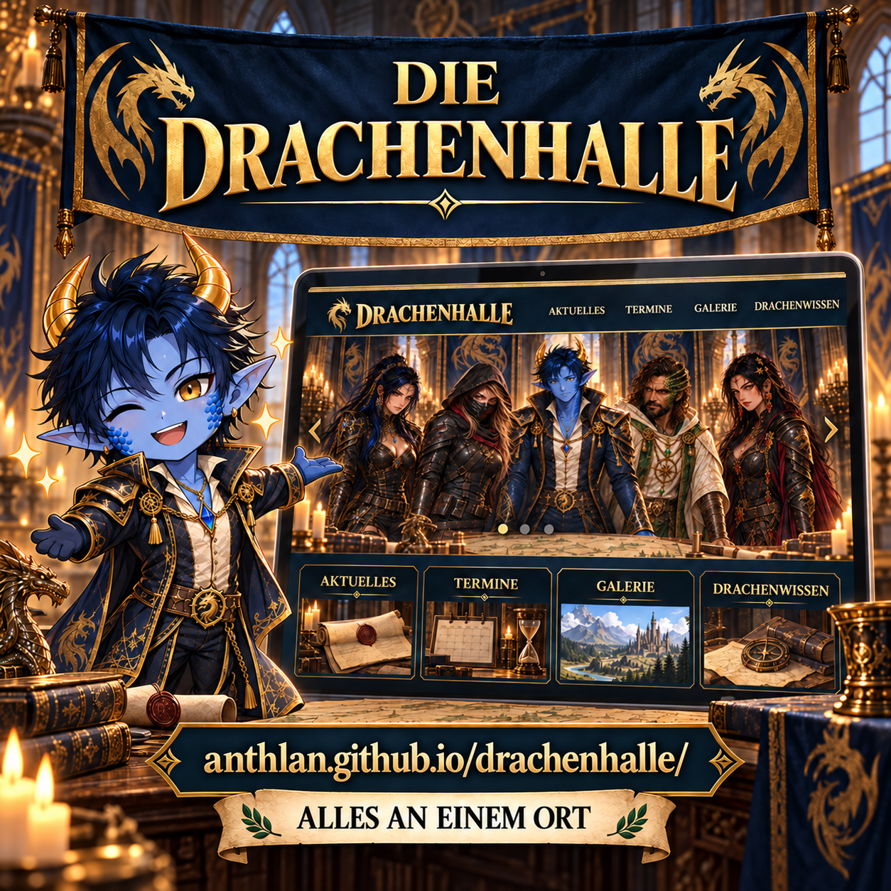

# Die Drachenhalle vorstellen

Die Drachenhalle ist unser gemeinsamer Ort für Neuigkeiten, Termine, Spielwissen und Bilder. Dieser Artikel fasst zusammen, warum sich ein regelmäßiger Besuch lohnt und wie wir neue oder bestehende Mitglieder auf die Website aufmerksam machen können.

## Was Mitglieder dort finden

- anstehende Termine mit Kalenderübernahme,
- Tipps, Strategien und ausführliche Event-Guides,
- die Galerie mit Chatbildern, Reaktionsbildern, Avataren und Charaktermodellen,
- aktuelle Ergänzungen des Archivs,
- sowie die Upload-Inbox für eigene Beiträge.

Die Mitteilung eignet sich besonders für neue Mitglieder, nach größeren Website-Erweiterungen oder als gelegentliche Erinnerung im Allianzchat.

## Grafiken

Die sachliche Variante stellt die Website und ihre Bereiche in den Mittelpunkt.


Die Chibi-Variante zeigt Anthlan als Präsentator und wirkt persönlicher.



## Allianz-Mitteilung zum Kopieren

```html
<color=#FFD700><b>DIE DRACHENHALLE</b></color>
Unsere Allianz-Website bringt alles Wichtige an einen Ort:

• <b>Termine</b> im Blick behalten und direkt in den Kalender übernehmen
• <b>Tipps & Strategien</b> jederzeit nachlesen
• <b>Galerie</b> mit Chatbildern, Avataren und Charakteren entdecken
• <b>Neuigkeiten</b> und neue Inhalte schnell finden
• Eigene Bilder und Dokumente einfach <b>einreichen</b>

<color=#7FFF00><b>Jetzt Drachenhalle besuchen:</b></color>
anthlan.github.io/drachenhalle/

Speichert euch den Link und schaut regelmäßig vorbei. So geht kein Termin, Tipp oder neues Bild mehr verloren.
```
