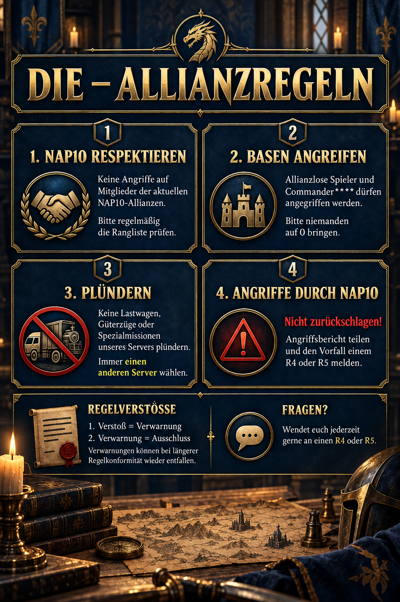

# DIE – Allianzregeln

Die Allianzregeln schützen unsere Mitglieder, vermeiden unnötige Konflikte und sorgen dafür, dass Angriffe und Beutezüge mit den Absprachen unseres Servers vereinbar bleiben. Im Zweifel gilt: erst prüfen, dann handeln und bei Unsicherheit einen R4 oder R5 fragen.



## 1. NAP10 respektieren

Mitglieder der aktuellen **NAP10-Allianzen dürfen nicht angegriffen werden**. Die Rangliste kann sich verändern; eine frühere Einordnung ist deshalb keine verlässliche Grundlage für einen späteren Angriff.

Prüft vor einem Angriff immer noch einmal die aktuelle Rangliste und die Allianzzugehörigkeit des Ziels. Befindet sich die Allianz in den NAP10 oder ist die Lage unklar, wird nicht angegriffen. So vermeiden wir Gegenangriffe und diplomatische Konflikte, die die gesamte Allianz betreffen können.

## 2. Erlaubte Basenangriffe

Angriffe sind auf **allianzlose Spieler** und auf Spieler mit einem Namen nach dem Muster **Commander\*\*\*\*** erlaubt. Auch bei einem erlaubten Ziel bleibt das Maß wichtig: Bitte niemanden vollständig auf **0** bringen.

Ein erlaubter Angriff ist kein Freibrief für unnötiges Nachsetzen. Beendet den Angriff, sobald das eigene Ziel erreicht ist, und prüft bei mehreren Angriffen erneut, ob sich Allianzname, Rang oder Situation geändert haben.

## 3. Richtig plündern

Lastwagen, Güterzüge und Spezialmissionen **unseres eigenen Servers** werden nicht geplündert. Wählt in der jeweiligen Ansicht immer ein Ziel von **einem anderen Server**.

Kontrolliert die Servernummer vor dem Start sorgfältig. Ein attraktiver Ertrag oder eine seltene Fracht ändert nichts an dieser Regel. Damit schützen wir die Zusammenarbeit auf dem eigenen Server und vermeiden unnötige Auseinandersetzungen mit anderen Allianzen.

## 4. Wenn ein NAP10-Mitglied angreift

Werdet ihr von einem Mitglied einer NAP10-Allianz angegriffen, gilt: **nicht zurückschlagen**. Ein direkter Gegenangriff kann die Klärung erschweren und aus einem einzelnen Vorfall einen größeren Konflikt machen.

Teilt stattdessen den Angriffsbericht und meldet den Vorfall einem **R4 oder R5**. Fügt nach Möglichkeit den Namen des Angreifers, seine Allianz und den Zeitpunkt hinzu. Die Allianzführung übernimmt anschließend die Abstimmung und informiert euch über das weitere Vorgehen.

## Regelverstöße und Verwarnungen

Beim ersten Regelverstoß wird eine **Verwarnung** ausgesprochen. Eine zweite Verwarnung führt zum **Ausschluss aus der Allianz**. Verwarnungen sollen regelkonformes Verhalten fördern und können nach einer längeren Zeit ohne weitere Verstöße wieder entfallen.

| Situation | Richtiges Verhalten |
| --- | --- |
| Ziel gehört zu einer aktuellen NAP10-Allianz | Nicht angreifen |
| Ziel ist allianzlos oder heißt Commander\*\*\*\* | Angriff erlaubt, aber nicht auf 0 bringen |
| Lastwagen, Güterzug oder Spezialmission stammt vom eigenen Server | Nicht plündern; anderes Serverziel wählen |
| NAP10-Mitglied greift euch an | Nicht zurückschlagen; Bericht an R4 oder R5 senden |
| Ihr seid unsicher | Vor der Aktion einen R4 oder R5 fragen |

> **Merksatz:** Erst Rangliste und Server prüfen. Bei einem NAP10-Vorfall nicht zurückschlagen, sondern melden.

## Allianz-Mitteilung zum Kopieren

```html
<size=46><b>DIE - ALLIANZREGELN</b></size>

🛡️ <size=40><b>1. NAP10 respektieren</b></size>
Keine Angriffe auf Mitglieder der aktuellen NAP10-Allianzen. Bitte regelmäßig die Rangliste prüfen.

🏰 <size=40><b>2. Basen angreifen</b></size>
Allianzlose Spieler und Commander**** dürfen angegriffen werden. Bitte niemanden auf 0 bringen.

🚚 <size=40><b>3. Plündern</b></size>
Keine Lastwagen, Güterzüge oder Spezialmissionen unseres Servers plündern. Immer <color=#9DBA32><b>einen anderen Server</b></color> wählen.

⚠️ <size=40><b>4. Angriffe durch NAP10</b></size>
<color=#E6A23C><b>Nicht zurückschlagen!</b></color> Angriffsbericht teilen und den Vorfall einem R4 oder R5 melden.

📌 <size=40><b>Regelverstöße</b></size>
1. Verstoß = Verwarnung, 2. Verwarnung = Ausschluss. Verwarnungen können bei längerer Regelkonformität wieder entfallen.

💬 <size=40><b>Fragen?</b></size>
Wendet euch jederzeit gerne an einen R4 oder R5.
```
