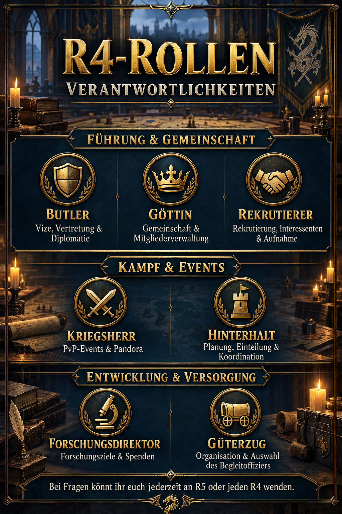

# R4-Rollen und Verantwortlichkeiten

Mit unseren R4-Rollen verteilen wir wiederkehrende Aufgaben auf klare Verantwortungsbereiche. Dadurch erkennt ihr schneller, an wen ihr euch mit einem bestimmten Anliegen wenden könnt. Wir verzichten bewusst auf Spielernamen, damit die Zuständigkeiten auch nach einem personellen Wechsel verständlich und aktuell bleiben.



## Wofür gibt es die Rollen?

Unsere R4 unterstützen die Allianzführung nicht nur allgemein, sondern übernehmen zusätzlich feste Themenbereiche. Dadurch beantworten wir Fragen schneller, bereiten Veranstaltungen verlässlicher vor und verhindern, dass organisatorische Aufgaben doppelt oder gar nicht erledigt werden.

Im Spiel gibt es die vier Kabinettsposten Butler, Göttin, Rekrutierer und Kriegsherr. Für unsere Organisation ergänzen wir sie um eigene Verantwortungsbereiche für Forschung, Allianz-Hinterhalt und Güterzug. Diese Aufteilung beschreibt unser gemeinsames Vorgehen und keine zusätzlichen technischen Spielrollen.

Keine Rolle ist eine abgeschottete Einzelzuständigkeit. Unsere R4 stimmen sich untereinander und mit R5 ab, vertreten einander bei Bedarf und geben ein Thema weiter, wenn mehrere Bereiche betroffen sind. Wenn ihr die zuständige Rolle nicht kennt oder niemanden erreicht, könnt ihr euch jederzeit an R5 oder jeden verfügbaren R4 wenden.

## Führung und Gemeinschaft

### Butler

Unser Butler ist **Vize und Vertretung von R5**. Er ist euer Ansprechpartner, wenn R5 nicht verfügbar ist, unterstützt uns bei übergreifenden Entscheidungen und übernimmt zusätzlich die **Diplomatie**.

Zur Diplomatie gehören unsere Absprachen und Klärungen mit anderen Allianzen sowie die Weitergabe wichtiger Vereinbarungen innerhalb unserer Führung. Bei Konflikten mit NAP-Allianzen oder anderen externen Anliegen sorgt der Butler gemeinsam mit R5 für einen geordneten Austausch.

### Göttin

Unsere Göttin kümmert sich um **Gemeinschaft und Mitgliederverwaltung**. Dazu gehören organisatorische Fragen rund um eure Mitgliedschaft sowie Anliegen zu Fairness, Sorgen, Problemen und unserem Miteinander.

Sie hilft uns dabei, interne Themen früh zu erkennen, Mitgliedsinformationen sauber zu halten und gemeinsam mit der Führung tragfähige Lösungen zu finden. Vertrauliche Anliegen tragen wir nicht unnötig im öffentlichen Allianzchat aus.

### Rekrutierer

Unser Rekrutierer verantwortet die **Gewinnung und Aufnahme neuer Mitglieder**. Er ist Ansprechpartner für Interessenten, führt erste Gespräche und stimmt offene Plätze sowie passende Aufnahmen mit unserer Führung ab.

Außerdem begleitet er neue Mitglieder bei ihrem Einstieg bei uns: Erwartungen, zentrale Regeln und wichtige Anlaufstellen sollen von Anfang an klar sein. Über die endgültige Aufnahme und besondere Ausnahmen entscheidet unsere Führung gemeinsam.

## Kampf und Events

### Kriegsherr

Unser Kriegsherr verantwortet die **PvP-Events, Pandora und die übergreifende Kampfkoordination**. Er bereitet uns auf die jeweiligen Kampfziele vor, gibt taktische Hinweise und koordiniert unsere Zusammenarbeit während der Veranstaltung.

Sein Bereich umfasst insbesondere Zielprioritäten, Sammelangriffe, Einsatzabsprachen und die verständliche Kommunikation unseres gemeinsamen Plans. Für den Allianz-Hinterhalt haben wir eine eigene Zuständigkeit.

### Hinterhalt-Verantwortlicher

Unser Hinterhalt-Verantwortlicher plant und koordiniert den **Allianz-Hinterhalt**. Er informiert euch über Ablauf und Zeitpunkt, unterstützt bei der Einteilung und sorgt dafür, dass alle Teilnehmenden unseren vereinbarten Plan kennen.

Er koordiniert außerdem, welche R4 oder R5 die Bonus-Sammelangriffe eröffnen, und berücksichtigt Vorbereitungs- und Marschzeiten. Während des Events bündelt er unsere Rückfragen und notwendige Anpassungen. Anschließend werten wir Erfahrungen und Ergebnisse aus, damit wir den nächsten Hinterhalt gezielt verbessern können.

## Entwicklung und Versorgung

### Forschungsdirektor

Unser Forschungsdirektor betreut die **Allianzforschung**. Er legt gemeinsam mit unserer Führung die nächsten Forschungsziele fest, markiert den priorisierten Knoten mit dem Führungsstern, kommuniziert die Priorität und erinnert uns bei Bedarf an passende Spenden.

So bündeln wir unsere Ressourcen, statt sie gleichzeitig auf viele Ziele zu verteilen. Vorschläge zu neuen Prioritäten könnt ihr über den Forschungsdirektor in die Abstimmung einbringen.

### Güterzug-Verantwortlicher

Unser Güterzug-Verantwortlicher organisiert den **Güterzug** und wählt den jeweiligen **Begleitoffizier** aus. Er achtet darauf, dass wir die Zuständigkeiten rechtzeitig klären und alle für den Ablauf nötigen Informationen erhalten.

Der Begleitoffizier unterstützt uns bei der konkreten Durchführung des jeweiligen Zuges. Die Auswahl kann je nach Verfügbarkeit, Aufgabe oder Situation wechseln, während die organisatorische Gesamtverantwortung bei unserem Güterzug-Verantwortlichen bleibt.

## Zuständigkeiten auf einen Blick

| Rolle | Verantwortung |
| --- | --- |
| Butler | Vize, Vertretung und Diplomatie |
| Göttin | Gemeinschaft und Mitgliederverwaltung |
| Rekrutierer | Interessenten, Rekrutierung und Aufnahme |
| Kriegsherr | PvP-Events, Pandora, Sammelangriffe und Kampfkoordination |
| Hinterhalt-Verantwortlicher | Planung, Bonus-Sammelangriffe und Koordination des Allianz-Hinterhalts |
| Forschungsdirektor | Allianzforschung, Führungsstern, Forschungsziele und Spenden |
| Güterzug-Verantwortlicher | Organisation des Güterzugs und Auswahl des Begleitoffiziers |

> **Unser Grundsatz:** Die Rollen geben uns klare Wege, ersetzen aber nicht die gemeinsame Verantwortung unserer gesamten R4- und R5-Führung.

## Allianz-Mitteilung zum Kopieren

```html
<size=40><color=#FFD700><b>🐉 R4-ROLLEN & VERANTWORTLICHKEITEN</b></color></size>
Damit ihr bei Fragen oder Problemen schnell die richtige Anlaufstelle findet:

<size=34><b>🛡️ Butler</b></size>
Vize & Vertretung • Diplomatie • Ansprechpartner, wenn R5 nicht da ist

<size=34><b>👑 Göttin</b></size>
Gemeinschaft • Mitgliederverwaltung • Sorgen, Probleme, Fairness & Miteinander

<size=34><b>📣 Rekrutierer</b></size>
Rekrutierung • neue Mitglieder & Interessenten

<size=34><b>⚔️ Kriegsherr</b></size>
PvP-Events • Pandora • Sammelangriffe & Kampfkoordination

<size=34><b>🏰 Hinterhalt</b></size>
Allianz-Hinterhalt • Bonus-Sammelangriffe • Planung & Koordination

<size=34><b>🔬 Forschungsdirektor</b></size>
Allianzforschung • Forschungsziele & Spenden

<size=34><b>🚂 Güterzug</b></size>
Organisation • Auswahl des Begleitoffiziers

<color=#7FFF00><b>Bei Fragen könnt ihr euch jederzeit an R5 oder jeden R4 wenden. 🐉</b></color>
```
