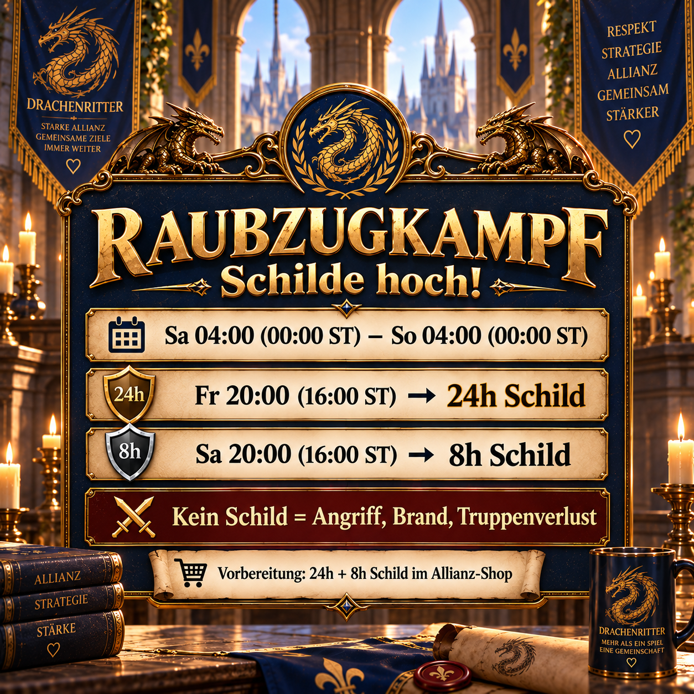

# Raubzugkämpfe: Schilde rechtzeitig setzen

Während der Raubzugkämpfe können Gegner anderer Server zu uns springen und ungeschützte Basen angreifen. Deshalb bereiten wir uns nicht erst mit dem Beginn des Kampfzeitraums vor, sondern besorgen die benötigten Schilde rechtzeitig und setzen sie nach einem gemeinsamen Plan.

Die Ankündigung verbindet drei Informationen, die für alle Mitglieder wichtig sind: den tatsächlichen Gefahrenzeitraum, die rechtzeitige Vorbereitung im Allianz-Shop und die beiden Zeitpunkte unseres Schildplans.



## Warum der Schildplan wichtig ist

Ein einzelner 24-Stunden-Schild deckt den gesamten Zeitraum nicht zuverlässig ab. Unser Plan kombiniert deshalb einen 24-Stunden- und einen 8-Stunden-Schild. So bleibt die Basis während des kritischen Zeitraums geschützt, ohne dass jedes Mitglied selbst rechnen muss.

Ohne Schild kann grundsätzlich jede Basis zum Ziel werden – unabhängig von ihrer Stärke. Wird eine Basis vollständig heruntergebrannt, können auf dem Übungsplatz sehr viele Soldaten verloren gehen. Wer am Raubzugkampf nicht aktiv teilnehmen möchte, schützt sich deshalb ebenfalls nach dem gemeinsamen Plan.

## Vorbereitung

- Besorgt vor Freitagabend **einen 24-Stunden-Schild und einen 8-Stunden-Schild** im Allianz-Shop.
- Setzt den ersten Schild pünktlich am Freitagabend.
- Verlängert den Schutz am Samstagabend mit dem 8-Stunden-Schild.
- Kontrolliert nach dem Aktivieren, ob die angezeigte Restlaufzeit den geplanten Zeitraum vollständig abdeckt.
- Achtet vor dem Versenden der Mitteilung darauf, ob lokale Zeit und Serverzeit weiterhin stimmen.

## Allianz-Mitteilung zum Kopieren

```html
<color=#FFD700><b>⚔️ Raubzugkampf – Schilde hoch! 🛡️</b></color>

Von <b>Samstag 04:00 Uhr (00:00 Serverzeit)</b> bis <b>Sonntag 04:00 Uhr (00:00 Serverzeit)</b> ist wieder Raubzugkampf. In dieser Zeit können Gegner von anderen Servern zu uns springen und unsere Basen angreifen.

<color=#87CEEB><b>Vorbereitung:</b></color>
Bitte besorgt euch rechtzeitig im Allianz-Shop <b>1× 24h-Schild + 1× 8h-Schild.</b>

<color=#90EE90><b>Unser Schildplan:</b></color>
<b>Freitag 20:00 Uhr (16:00 Serverzeit)</b> → 24h-Schild
<b>Samstag 20:00 Uhr (16:00 Serverzeit)</b> → 8h-Schild

<color=#FF6347><b>⚠️ Wichtig:</b></color> Ohne Schild kann <b>jeder</b> zum Ziel werden – unabhängig von der Stärke. Wird die Basis auf 0 gebrannt, sterben massiv Soldaten auf dem Übungsplatz.

<b>Also: Schild drauf und Verluste vermeiden! 🛡️</b>
```
