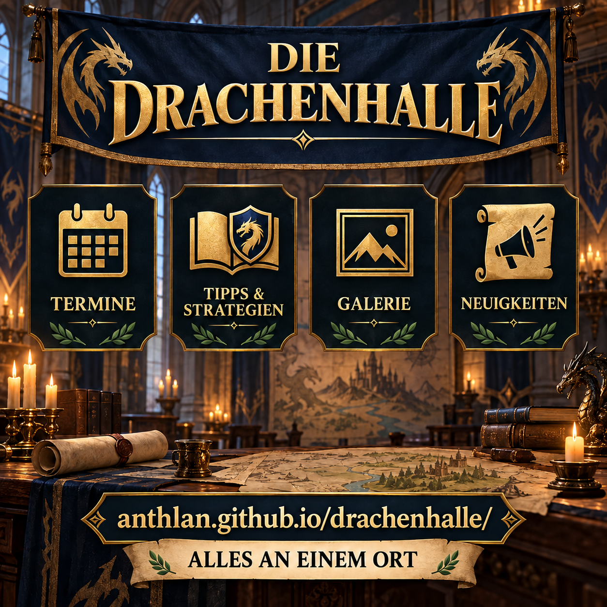

# DIE Drachenhalle

Die Website der Allianz bündelt Neuigkeiten, Termine, Spielwissen und Bilder an einem Ort. Die folgende Mitteilung kann direkt im Spiel veröffentlicht und zusammen mit der gleichnamigen Grafik geteilt werden.

## Allianz-Mitteilung zum Kopieren

```html
<color=#FFD700><b>DIE DRACHENHALLE</b></color>
Unsere Allianz-Website bringt alles Wichtige an einen Ort:

• <b>Termine</b> im Blick behalten und direkt in den Kalender übernehmen
• <b>Tipps & Strategien</b> jederzeit nachlesen
• <b>Galerie</b> mit Chatbildern, Avataren und Charakteren entdecken
• <b>Neuigkeiten</b> und neue Inhalte schnell finden
• Eigene Bilder und Dokumente einfach <b>einreichen</b>

<color=#7FFF00><b>Jetzt Drachenhalle besuchen:</b></color>
anthlan.github.io/drachenhalle/

Speichert euch den Link und schaut regelmäßig vorbei. So geht kein Termin, Tipp oder neues Bild mehr verloren.
```

## Grafik



## Chibi-Variante

Diese Variante zeigt Chibi-Anthlan als Präsentator und rückt die tatsächlichen Bereiche der Website stärker in den Mittelpunkt.


