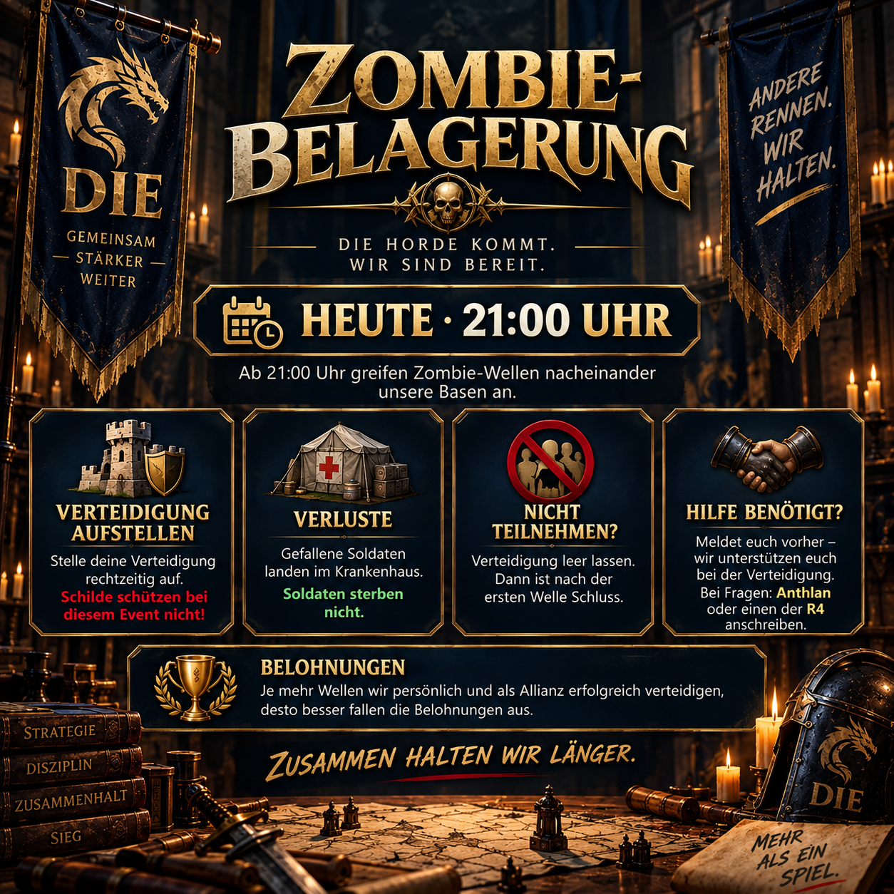

# Zombie-Belagerung: gemeinsam Wellen verteidigen

Bei der Zombie-Belagerung greifen mehrere Wellen nacheinander unsere Basen an. Anders als bei einem gewöhnlichen Angriff hilft ein aktivierter Schild hier nicht. Entscheidend sind eine aufgestellte Verteidigung, ausreichend Platz im Krankenhaus und die rechtzeitige Abstimmung innerhalb der Allianz.

Die Ankündigung erklärt den Ablauf so, dass sowohl aktive Teilnehmende als auch Mitglieder, die diesmal aussetzen möchten, wissen, was sie tun müssen.



## So funktioniert die Teilnahme

Wer teilnehmen möchte, stellt vor Beginn eine Verteidigung auf. Mit jeder überstandenen Welle steigt die persönliche Leistung und zugleich der Beitrag zum gemeinsamen Allianz-Ergebnis. Wird die eigene Verteidigung durchbrochen, endet die Belagerung für die betroffene Person.

Die im Event entstehenden Verluste landen im Krankenhaus; die Soldaten sterben dabei nicht. Trotzdem sollte vor Beginn geprüft werden, ob genügend Krankenhauskapazität vorhanden ist.

## Aussetzen oder Unterstützung erhalten

Wer nicht teilnehmen möchte, lässt die Verteidigung leer. Dadurch ist nach der ersten Welle Schluss, ohne dass weitere Vorbereitungen nötig sind.

Wer Unterstützung bei der Verteidigung benötigt, meldet sich möglichst vor dem Start. So bleibt genug Zeit, die Hilfe innerhalb der Allianz abzustimmen. Anthlan und die R4 sind dafür die ersten Anlaufstellen.

> **Vor dem Versenden:** `[UHRZEIT]` durch die für diesen Termin angekündigte lokale Uhrzeit ersetzen. Die vorhandene Grafik zeigt die Variante für **21:00 Uhr**.

## Allianz-Mitteilung zum Kopieren

```html
<color=#FFD700><b>🧟 ZOMBIE-BELAGERUNG – HEUTE [UHRZEIT]</b></color>

Ab <color=#FFD700><b>[UHRZEIT] Uhr</b></color> greifen Zombie-Wellen nacheinander unsere Basen an.

🛡️ <b>Verteidigung aufstellen</b> – Schilde schützen hier nicht.
🏥 Verluste landen im <b>Krankenhaus</b>, Soldaten sterben nicht.
💀 Wird eure Verteidigung durchbrochen, ist für euch Schluss.
🏆 Je mehr Wellen wir schaffen, desto besser die persönlichen & Allianz-Belohnungen.

<b>Ihr wollt nicht teilnehmen?</b> Verteidigung leer lassen → nach Welle 1 ist Schluss.

<b>Ihr braucht Unterstützung bei der Verteidigung?</b> Meldet euch vorher, dann helfen wir euch.

<color=#90EE90><b>Fragen?</b></color> Einfach Anthlan oder einen der R4 anschreiben.
```
