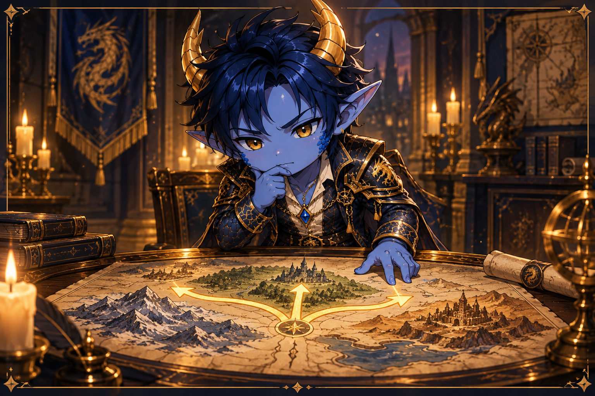
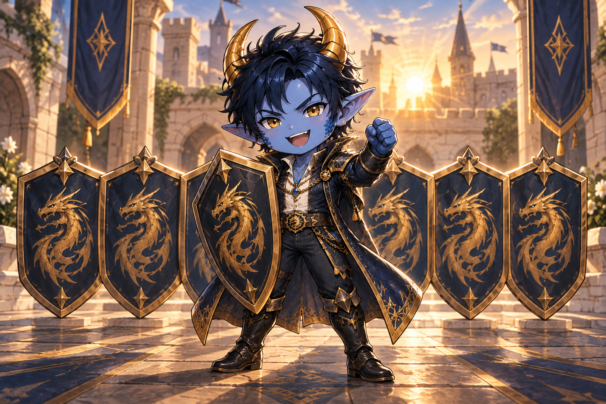
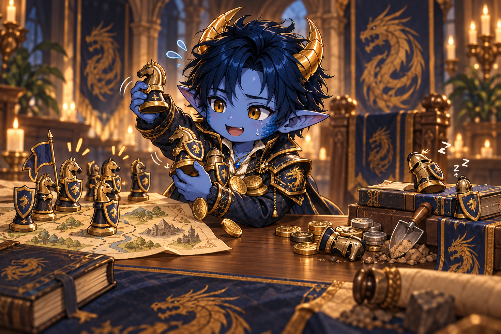
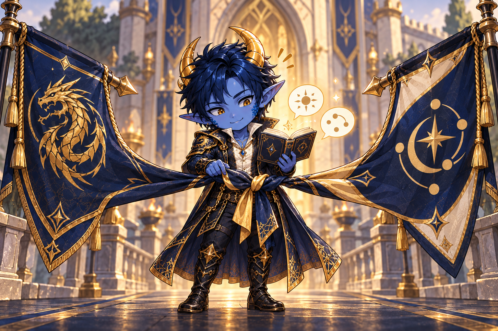

# Zukunft der Allianz – interne Beratung

##HIDDEN

Diese Seite ist als interne Diskussionsgrundlage für den Allianzrat gedacht. Sie soll uns helfen, die möglichen Wege offen und sachlich zu vergleichen. Es geht noch nicht um eine fertige Entscheidung, sondern zunächst um die Frage, welche Allianz wir künftig sein wollen und welches Maß an Aktivität und Teamplay wir dafür voraussetzen.

## Die zentrale Frage

Wollen wir vor allem eine möglichst große und einflussreiche Allianz bleiben – auch wenn ein Teil unserer Mitglieder nur wenig aktiv am gemeinsamen Spiel teilnimmt? Oder wollen wir eine kleinere, dafür verlässlich aktive Gemeinschaft sein, in der gemeinsames Handeln und die Teilnahme an Events stärker eingefordert werden?

Dabei müssen wir nicht nur auf Macht und Ranglistenplätze schauen. Ebenso wichtig sind Verlässlichkeit, Motivation, Gemeinschaftsgefühl und die Frage, welches Modell langfristig tragfähig ist.

## Weg 1: Kleiner, aber konsequent aktiv

Wir trennen uns von dauerhaft passiven Mitgliedern und erwarten von den verbleibenden sowie von neuen Mitgliedern eine klar definierte Mindestaktivität. Dazu gehören insbesondere die Beteiligung an wichtigen Allianz-Events, verlässliches Teamplay und die Einhaltung gemeinsamer Absprachen.

### Chancen

- Wir können uns stärker darauf verlassen, dass Absprachen eingehalten werden und die Allianz geschlossen reagiert.
- Es entsteht eher das Gefühl, dass alle an einem Strang ziehen und ihren Teil zum gemeinsamen Erfolg beitragen.
- Angriffe und Versammlungen lassen sich schneller und verlässlicher füllen; lange Wartezeiten durch fehlende Beteiligung nehmen ab.
- Wenn wir samstags geschlossen mit Schilden stehen, wirkt das organisiert, diszipliniert und nach außen geschlossen.
- Durch den Verlust an Gesamtpunkten könnten wir im Allianz-Wettbewerb auf Gegner treffen, die besser zu unserer tatsächlichen aktiven Stärke passen und eher zu schlagen sind.
- Aktive Mitglieder erleben ihren eigenen Einsatz als wertvoller, weil die Erwartungen für alle sichtbar gelten.

### Risiken

- Uns fehlen passive oder halbaktive Mitglieder, die bisher regelmäßig für die Allianzforschung spenden oder Allianz-Ausgrabungen starten.
- Unsere Gesamtmacht sinkt deutlich; ein Herausfallen aus den Top 10 ist wahrscheinlich.
- Mit einem niedrigeren Rang hätten wir möglicherweise weniger Einfluss auf dem Server und weniger Gewicht in gemeinsamen Chats und Absprachen.
- Es besteht das Risiko, dass uns die Level-3-Stadt aberkannt wird.
- Eine kleine Allianz ist anfälliger für Urlaube, Pausen oder einzelne Abgänge, weil jede fehlende Person stärker ins Gewicht fällt.
- Zu starre Anforderungen können auch grundsätzlich aktive Mitglieder unter Druck setzen. Wer engagiert ist, aber nicht jedes Event mitspielen kann, könnte die Motivation verlieren.
- Wenn wir zu schnell aussortieren, kann eine Abwärtsspirale entstehen: weniger Mitglieder, weniger sichtbare Stärke, weniger neue Bewerber und dadurch noch weniger Mitglieder.

## Weg 2: Passive und halbaktive Mitglieder behalten

Wir halten bewusst an einer größeren Mitgliederbasis fest und akzeptieren, dass nicht alle Mitglieder in gleichem Umfang an Events, Kämpfen und Absprachen teilnehmen. Aktivität bleibt erwünscht, wird aber nur in begrenztem Maß vorausgesetzt.

### Chancen

- Unsere Gesamtmacht und damit unsere Position in der Rangliste bleiben eher erhalten.
- Wir sichern unseren Einfluss auf dem Server und unser Gewicht in allianzübergreifenden Gesprächen.
- Die Chance, unsere Level-3-Stadt zu behalten, ist höher.
- Auch weniger aktive Mitglieder leisten einen Beitrag, etwa durch Forschungsspenden, Allianz-Ausgrabungen oder gelegentliche Eventteilnahme.
- Das Modell bietet Platz für Menschen mit wechselnder Verfügbarkeit und vermeidet unnötigen Druck.
- Eine große Mitgliederzahl kann Stabilität und Attraktivität nach außen vermitteln.

### Risiken

- Bei wichtigen Events und gemeinsamen Aktionen bleibt unklar, auf wen wir uns tatsächlich verlassen können.
- Angriffe und Versammlungen füllen sich langsamer oder gar nicht; die aktive Gruppe trägt einen überproportional großen Teil der Arbeit.
- Absprachen wie das geschlossene Setzen von Schilden werden nur teilweise umgesetzt und lassen uns unorganisiert wirken.
- Unsere Gesamtmacht kann stärker aussehen, als unsere tatsächlich verfügbare Kampfkraft ist. Dadurch treffen wir möglicherweise auf Wettbewerbsgegner, die für unseren aktiven Kern zu stark sind.
- Aktive Mitglieder können den Eindruck gewinnen, dass ihr Einsatz selbstverständlich ist, während fehlende Beteiligung folgenlos bleibt.
- Die größte Gefahr ist ein schleichender Motivationsverlust bei den Engagierten. Wenn gerade die aktiven Mitglieder gehen, bleibt zwar zunächst die Größe bestehen, die Allianz verliert aber ihre Handlungsfähigkeit.

## Weg 3: Fusion mit einer ähnlich großen Allianz

Wir suchen eine ähnlich große Allianz, mit der wir Mitglieder, Führung und Strukturen zusammenführen. Da derzeit keine passende deutsche Allianz zur Verfügung steht, wäre eine Fusion voraussichtlich international und müsste sprachlich sowie kulturell gut vorbereitet werden.

### Chancen

- Zwei aktive Kerne könnten gemeinsam eine deutlich verlässlichere und schlagkräftigere Allianz bilden.
- Lücken bei Eventteilnahme, Versammlungen, Forschung und Organisation ließen sich durch eine größere aktive Basis besser auffangen.
- Gesamtmacht, Ranglistenposition und Einfluss auf dem Server könnten erhalten bleiben oder sogar wachsen.
- Eine Fusion kann neue Motivation, Wissen, Kontakte und taktische Möglichkeiten bringen.
- Führungsaufgaben könnten auf mehr Schultern verteilt und R4-Zuständigkeiten stabiler besetzt werden.
- Bei guter Vorbereitung ließe sich möglicherweise sowohl die Wettbewerbsfähigkeit als auch eine lebendige Gemeinschaft sichern.

### Risiken

- Der mögliche Identitätsverlust ist erheblich: Name, gewachsene Kultur, Regeln, Führungsstil und das bisherige Gemeinschaftsgefühl von DIE könnten verwässert werden oder ganz verloren gehen.
- Da es keine passende deutsche Allianz für eine Fusion gibt, ist eine Sprachbarriere sehr wahrscheinlich. Absprachen bei Events und Angriffen werden dadurch schwieriger, langsamer und fehleranfälliger.
- Unterschiedliche Erwartungen an Aktivität, Teamplay, Kommunikation und Konfliktlösung können schnell zu Spannungen führen.
- Eine Fusion wirft schwierige Machtfragen auf: Wer führt, wie werden R4-Plätze verteilt und welche bisherigen Regeln bleiben bestehen?
- Nicht alle Mitglieder werden den Wechsel mittragen. Gerade langjährige Mitglieder könnten sich in der neuen Gemeinschaft nicht mehr zuhause fühlen.
- Wenn die Zusammenführung schlecht vorbereitet ist, entstehen Gruppenbildung und ein „wir gegen die anderen“ statt einer gemeinsamen neuen Allianz.
- Praktische Grenzen wie Mitgliederplätze, Stadtbesitz und die Auswahl der aufnehmenden Allianz können dazu führen, dass nicht alle mitgenommen werden können.
- Scheitert die Fusion, könnten wir gleichzeitig Mitglieder, Identität und Verhandlungsspielraum verlieren.

## Ein möglicher Zwischenweg ohne sofortige Fusion

Bevor wir uns endgültig für einen der drei Wege entscheiden, könnten wir eine zeitlich begrenzte Aktivitätsphase vereinbaren. Dabei definieren wir wenige, klare Mindestanforderungen und beobachten über mehrere Wochen, wie viele Mitglieder diese tatsächlich erfüllen.

Mögliche Bausteine wären:

- klare Pflichttermine nur für wenige, besonders wichtige Allianz-Events;
- eine Abmeldungsmöglichkeit bei Urlaub, Krankheit oder privaten Verpflichtungen;
- unterschiedliche Erwartungen an aktive Kämpfer, Unterstützer und Mitglieder in einer vorübergehenden Pause;
- eine transparente Verwarnungs- oder Gesprächsphase vor einem Ausschluss;
- gezielte Rekrutierung aktiver Spieler, bevor Plätze konsequent neu vergeben werden;
- eine feste Testdauer mit anschließender Auswertung im Allianzrat.

Dieser Weg könnte zeigen, wie groß unser tatsächlich verlässlicher Kern ist, ohne sofort unumkehrbare Entscheidungen zu treffen. Er löst den Grundkonflikt jedoch nur, wenn wir die vereinbarten Regeln später auch konsequent anwenden.

## Kriterien für unsere Entscheidung

Bevor wir über einzelne Mitglieder sprechen, sollten wir uns auf die gemeinsamen Maßstäbe einigen:

1. **Was bedeutet „aktiv“ für uns konkret?** Tägliche Anwesenheit, Eventteilnahme, Forschungsspenden, Reaktion auf Nachrichten oder eine Kombination daraus?
2. **Welche Events und Absprachen sind wirklich verpflichtend?** Nicht alles muss denselben Stellenwert haben.
3. **Wie unterscheiden wir fehlenden Willen von begrenzter Zeit?** Verlässliche Abmeldung und Kommunikation könnten wichtiger sein als reine Online-Zeit.
4. **Wie wichtig sind uns Top 10 und Servereinfluss im Vergleich zu internem Teamplay?**
5. **Welches Risiko besteht tatsächlich für unsere Level-3-Stadt und wie schwer wiegt es?**
6. **Wie viele verlässlich aktive Mitglieder benötigen wir mindestens, damit Events, Versammlungen und Forschung funktionieren?**
7. **Welche Kompromisse sind wir bereit einzugehen, um unsere Identität als deutsche Allianz zu bewahren?**
8. **Woran messen wir nach einigen Wochen, ob unser gewählter Weg funktioniert?**

## Fragen an den Allianzrat

- Welches Zielbild für DIE wollen wir in sechs Monaten erreicht haben?
- Was gefährdet unsere Allianz stärker: der Verlust von Macht und Rang oder der Motivationsverlust unserer aktiven Mitglieder?
- Welche Mindestbeteiligung können wir fair verlangen, ohne aus dem Spiel eine Pflichtveranstaltung zu machen?
- Welche Beiträge weniger aktiver Mitglieder sind für uns trotzdem wertvoll?
- Können wir einen verbindlichen Zwischenweg glaubwürdig umsetzen, oder verschieben wir damit nur die Entscheidung?
- Unter welchen Bedingungen wäre eine Fusion überhaupt akzeptabel?
- Welche Punkte wären bei einer Fusion nicht verhandelbar – insbesondere Name, Identität, Sprache, Führung und gemeinsame Regeln?

## Ziel der Beratung

Am Ende sollten wir nicht nur zwischen „Mitglieder behalten“ und „Mitglieder entfernen“ entscheiden. Wir brauchen ein gemeinsames, verständliches Modell dafür,

- wofür DIE stehen soll,
- welchen Beitrag wir voneinander erwarten,
- wie wir mit vorübergehender Inaktivität umgehen,
- wie wir aktive Mitglieder langfristig motivieren und
- welche Bedeutung Macht, Rang, Stadt und Servereinfluss für uns haben.

Erst wenn dieses Zielbild steht, können wir fair beurteilen, welcher Weg am besten zu uns passt und welche konkreten Schritte daraus folgen.
