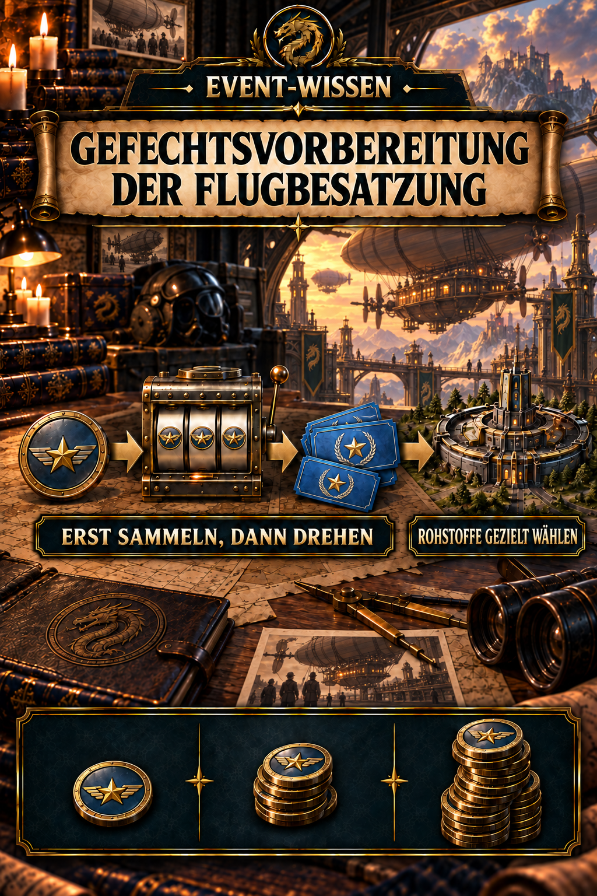
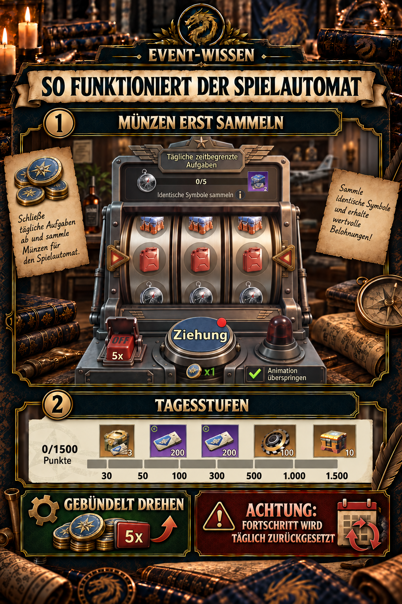
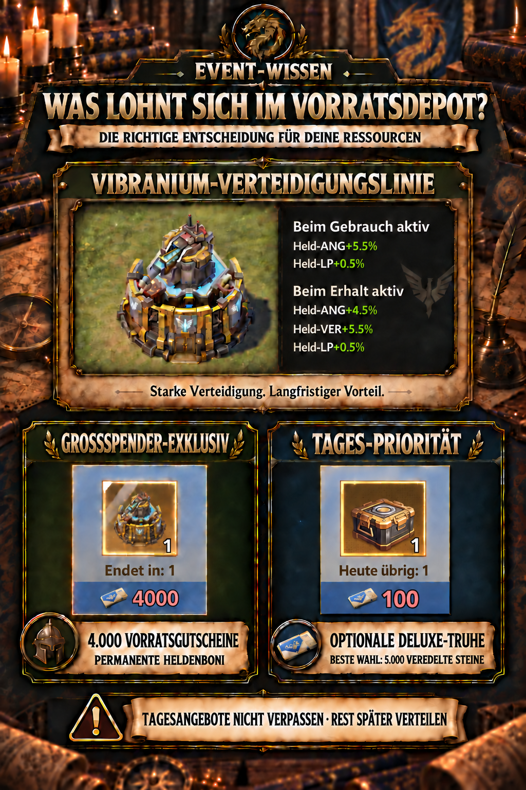
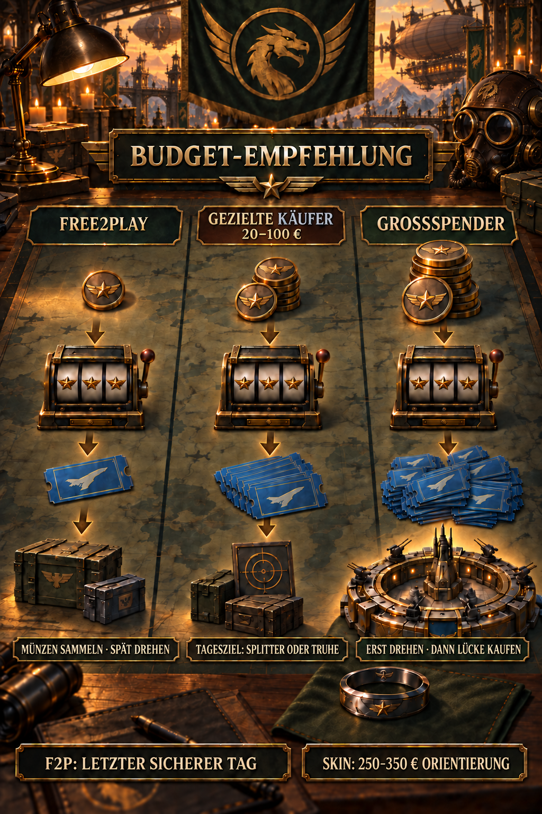

# ✈️ Event – Gefechtsvorbereitung der Flugbesatzung

## Das Wichtigste in Kürze

- In der **Startsequenz sind 15 Fliegende-Stern-Münzen pro Eventtag** erspielbar. Über fünf Eventtage sind das **75 Münzen**.
- Dazu kommt **eine kostenlose Münze je Shop-Reset**. Bei acht erreichbaren Reset-Fenstern sind damit insgesamt bis zu **83 kostenlose Münzen** möglich.
- Münzen nicht sofort einzeln ausgeben: Der Punktefortschritt des Spielautomaten wird täglich zurückgesetzt. Erst sammeln, dann gezielt einen Tagesmeilenstein bei **30, 50, 100, 300, 500, 1.000 oder 1.500 Punkten** erreichen.
- Das sinnvolle Hauptziel für Free2Play und **Gezielte Käufer** sind dauerhafte Progressionsmaterialien. Die täglich limitierte **Optionale Deluxe-Truhe** ist besonders stark, wenn daraus 5.000 Veredelte Steine gewählt werden.
- **Free2Play** sammelt Münzen und bündelt die Ziehungen möglichst auf den letzten sicheren Nutzungstag. **Gezielte Käufer** können dagegen täglich UR-Omni-Heldensplitter oder die Optionale Deluxe-Truhe sichern.
- Die **Vibranium-Verteidigungslinie für 4.000 Vorratsgutscheine** ist stark, aber realistisch eine exklusive Belohnung für Großspender – kein vernünftiges Hauptziel für 0 bis 100 € Budget.
- Bei den direkten Vorratsgutschein-Paketen bietet **2,49 € für 20 Gutscheine** den besten Kurs. Von 5,99 € bis 119,99 € bleibt der Kurs mit etwa 0,15 € je Gutschein praktisch konstant.

> **Kurzempfehlung:** F2P sammelt Münzen bis zum letzten sicheren Nutzungstag und entscheidet danach über die Vorratsgutscheine. Gezielte Käufer sichern täglich nur die gewünschten UR-Omni-Heldensplitter oder Deluxe-Truhen. Beim Skin-Ziel zuerst alle Ziehungen abschließen und erst danach die verbleibende Gutscheinlücke kaufen.



## Wofür ist dieser Event-Guide?

Dieser Guide ordnet das zeitlich begrenzte Event **Gefechtsvorbereitung der Flugbesatzung** ein. Er erklärt die Eventwährungen, den Flughafen-Spielautomaten, den Vorratsladen und die sinnvollsten Ausgaben für Free2Play-Spieler, Gezielte Käufer und Großspender. Letztere werden in der Gaming-Sprache häufig als **„Whales“** bezeichnet.

Die Bereiche besitzen teilweise unterschiedliche Restlaufzeiten. Prüft deshalb immer den Timer des jeweiligen Reiters und löst Münzen sowie Vorratsgutscheine nicht erst in der letzten Minute ein.

## Wie viele kostenlose Münzen gibt es?

An jedem der fünf Eventtage sind in der Startsequenz insgesamt **15 Fliegende-Stern-Münzen** erspielbar. Die konkreten Quellen und Aufgaben unterscheiden sich je nach Eventtag. Für die Planung zählt daher die einfache Rechnung: **15 Münzen × 5 Eventtage = 75 Münzen**.

Im Shop gibt es außerdem **eine kostenlose Münze pro Reset**. Der beim Eventstart sichtbare Timer von mehr als sieben Tagen ermöglicht voraussichtlich acht Abholungen. Wer alle fünf Eventtage vollständig abschließt und jedes Reset-Fenster erwischt, kommt damit auf **bis zu 83 kostenlose Münzen**. Verpasst ihr Aufgaben oder einen Reset, fällt die Summe entsprechend kleiner aus.

Wichtig: Die täglich verfügbaren Feierpunkte der fünf Eventtage sind eine eigene Ressource für die Tagesaufgaben und keine zusätzlichen Fliegenden-Stern-Münzen.

## Die drei wichtigsten Eventressourcen

| Ressource | Verwendung | Empfehlung |
| --- | --- | --- |
| **Fliegende-Stern-Münzen** | Eine Münze bezahlt eine normale Ziehung am Flughafen-Spielautomaten. Der 5×-Modus vervielfacht Einsatz und Belohnung. | Kostenlos einsammeln und für einen guten Tagesmeilenstein bündeln. |
| **Vorratsgutscheine** | Entstehen durch Ziehungen, Kombinationen, Tagesstufen und Bonusziehungen. Sie werden im Vorratsdepot ausgegeben. | Tagesangebote nur bei klarem Ziel kaufen; sonst sammeln und vor Ablauf des Vorratsdepots gezielt verteilen. |
| **Hilfsgüter** | Sind durch die Erledigung der **„Startzeit“-Aufgaben** sowie durch tägliche Aktivität erspielbar. Weitere Eventbereiche können zusätzliche Hilfsgüter liefern. | Alle verfügbaren Eventaufgaben und Reiter regelmäßig prüfen. |

## Spielautomaten richtig nutzen

Jede Ziehung gewährt Punkte für die tägliche Fortschrittsleiste. Sichtbar sind Stufen bei **30, 50, 100, 300, 500, 1.000 und 1.500 Punkten**. Dieser Zähler wird täglich zurückgesetzt.

Deshalb gilt:

1. Holt kostenlose Münzen und Aufgabenbelohnungen täglich ab.
2. Dreht nicht automatisch sofort nach jeder erhaltenen Münze.
3. Sammelt, bis ihr einen sinnvollen Tagesmeilenstein sicher erreichen könnt.
4. Nutzt 5× nur als Abkürzung; Einsatz und Belohnung werden gleichermaßen verfünffacht.
5. Stoppt nach dem geplanten Meilenstein. Nicht wegen bereits ausgegebener Münzen unkontrolliert nachkaufen.

Nicht verbrauchte Münzen werden nach Eventende laut Eventregel umgewandelt. **Eine Münze entspricht 30 Beschleunigern zu je fünf Minuten**, also 150 Minuten. Das verhindert einen vollständigen Verlust, ist aber meist schwächer als gezielt erreichte Tagesstufen und Ziehungsbelohnungen.



### Warum der Skin ohne Großspender-Budget unrealistisch ist

Die lila Grundbelohnung einer Ziehung beträgt 5, 50, 250 oder 500 Vorratsgutscheine. Aus den angezeigten Wahrscheinlichkeiten ergibt sich rechnerisch ein Erwartungswert von rund **10 Vorratsgutscheinen je Münze** allein aus dieser Grundbelohnung. Kombinationen, Tagesstufen und Luftabwurf-Boni kommen hinzu, sind aber zufallsabhängig.

Rein über den Grundwert wären für 4.000 Vorratsgutscheine im Mittel etwa **400 Münzen** nötig. Die bis zu 83 kostenlosen Münzen entsprechen auf dieser Basis rund **830 erwarteten Vorratsgutscheinen**. Kombinationen, Tagesstufen und Bonusziehungen erhöhen den Ertrag, schließen die große Lücke zum Skin aber nicht zuverlässig. Auch ein Budget bis 100 € bleibt stark vom Glück abhängig und sollte nicht um den Skin herum geplant werden.

Enthält ein Ergebnis ein Luftabwurf-Truhensymbol, entsteht eine zusätzliche Auswahlchance. Der sichtbare Bonuspool besteht zu **40 % aus Vorratsgutscheinen** und zu **60 % aus Veredelten Steinen**. Das ist wertvoll, aber ebenfalls keine Garantie für eine bestimmte Menge an Vorratsgutscheinen.

## Wann Vorratsgutscheine ausgeben?

Im Vorratsdepot gibt es zwei unterschiedliche Arten von Kauflimits:

- **„Heute übrig: 1“** wird beim täglichen Reset erneuert. Ein ausgelassener Kauf kann später nicht nachgeholt werden.
- **„Endet in: …“** bezeichnet das verbleibende Limit für den gesamten Angebotszeitraum. Diese Käufe können bis kurz vor Ablauf gesammelt geplant werden.

Darum sollten Vorratsgutscheine **nicht pauschal jeden Tag** ausgegeben werden. Eine tägliche Ausgabe ist nur sinnvoll, wenn eines dieser beiden Tagesangebote euer festes Ziel ist:

1. **UR-Omni-Heldensplitter:** 10 Splitter für 60 Vorratsgutscheine, einmal täglich. Wer diese seltenen Splitter gezielt aufbauen möchte, muss den Kauf an jedem gewünschten Tag durchführen.
2. **Optionale Deluxe-Truhe:** eine Truhe für 100 Vorratsgutscheine, einmal täglich. Auch hier verfällt die Kaufchance mit dem Reset.

Wenn keines dieser Tagesangebote euer Ziel ist, sammelt die Vorratsgutscheine. So kennt ihr gegen Eventende euren Gesamtbestand und könnt ihn ohne unnötige Restbeträge auf die eventweit begrenzten Angebote verteilen. Wartet dabei nicht bis zur letzten Minute, sondern löst rechtzeitig vor dem Timer des Vorratsdepots ein.

### Direkte Vorratsgutscheine pro Tag

Die neuen Angebotsansichten zeigen zwei tägliche kostenlose beziehungsweise diamantfinanzierte Quellen:

- **1 Vorratsgutschein pro Tag kostenlos**
- **1 weiterer Vorratsgutschein für 500 Diamanten**, einmal täglich

Damit sind direkt höchstens zwei Gutscheine pro Tag möglich, aber nur einer davon ist wirklich kostenlos. **500 Diamanten für einen einzelnen Vorratsgutschein sind für F2P in der Regel kein guter Standardtausch.** Sinnvoll kann er nur sein, wenn genau dieser eine Gutschein einen wichtigen Tageskauf oder einen vollständigen Tausch ermöglicht.

### Bewertung der Optionalen Deluxe-Truhe

Für 100 Vorratsgutscheine darf eine der sichtbaren Belohnungen gewählt werden:

- 10 UR-Omni-Heldensplitter
- 40 der sichtbaren goldenen Komponenten
- 5.000 Veredelte Steine
- 1 Stufe-5-Truhe
- 15 der sichtbaren Fortschrittskisten

Die **5.000 Veredelten Steine** sind die stärkste allgemeine und sicher bezifferbare Wahl. Sie entsprechen **50 Steinen je Vorratsgutschein**. Der normale Tausch bietet 100 Steine für 4 Vorratsgutscheine, also nur 25 Steine je Vorratsgutschein. Wer ohnehin Veredelte Steine benötigt, erhält über die tägliche Deluxe-Truhe damit den **doppelten Gegenwert**.

Für UR-Omni-Heldensplitter ist die Deluxe-Truhe dagegen nicht der beste Kurs: Das direkte Tagesangebot liefert 10 Splitter für 60 Vorratsgutscheine, während dieselben 10 Splitter über die Truhe 100 kosten. Die übrigen Inhalte sind nur vorzuziehen, wenn genau dieses Material den eigenen Fortschritt stärker begrenzt als 5.000 Veredelte Steine.

## Vorratsdepot: Ranking nach Preis/Leistung

Das Ranking bewertet zwei Dinge: **langfristigen Machtzuwachs** und **Gegenwert je Vorratsgutschein**. Ein persönlicher Engpass kann die Reihenfolge verändern.

| Rang | Angebot | Eventkurs | Nachhaltiger Nutzen | Bewertung |
| ---: | --- | ---: | --- | --- |
| **1** | **Optionale Deluxe-Truhe → 5.000 Veredelte Steine** | 1 für 100, einmal täglich | 50 Steine je Vorratsgutschein und dauerhafte Ausrüstungsprogression | **Bester allgemeiner Tageskauf** |
| **2** | **UR-Omni-Heldensplitter** | 10 für 60, einmal täglich | Seltene und flexible dauerhafte Heldenprogression | **Top-Ziel für passende UR-Helden** |
| **3** | **Veredelte Steine direkt** | 100 für 4 | 25 Steine je Vorratsgutschein; günstig und bis zum Eventende planbar | **Beste Restverwertung** |
| **4** | **Heldenbücher** | 100 für 4 | Dauerhafter Heldenfortschritt; besonders gut, wenn Heldenlevel bremsen | **Sehr stark bei Bedarf** |
| **5** | **Forschungsmaterial** | 100 für 40 | Forschung bleibt dauerhaft, der Kurs ist aber deutlich teurer | **Gut bei Forschungsengpass** |
| **6** | **Gezielte Baupläne, Fragmente und Gebäudeteile** | 16 bis 300 | Sehr hoch, wenn damit direkt ein permanenter Bonus oder die nächste Stufe freigeschaltet wird | **Detailbonus und Restbedarf prüfen** |
| **7** | **10.000er Flug-/Kampfmaterial** | 10.000 für 16 | Kann dauerhaften Systemfortschritt liefern; Wert hängt vom konkreten Engpass ab | **Situativ gut** |
| **8** | **Ausrüstungs-/Fortschrittskisten** | 1 für 8 | Günstig, aber Inhalt und Nutzen sind weniger planbar | **Solide Ergänzung** |
| **9** | **3-Stunden-Beschleuniger** | 1 für 16 | 11,25 Minuten je Vorratsgutschein; verbrauchbar statt dauerhaft | **Nur für akuten Zeitengpass** |
| **10** | **Leicht farmbare Rohstoffe** | z. B. 100 Holz für 60 | Keine seltene permanente Progression | **Schwächster allgemeiner Tausch** |

Bei Bauplänen, Fragmenten und Gebäudeteilen gilt eine wichtige Ausnahme: Wenn ein einzelner Kauf unmittelbar einen starken permanenten Bonus freischaltet, kann dieser Kauf weiter oben liegen. Ohne dieses konkrete Ziel sind die Deluxe-Truhe mit 5.000 Steinen und anschließend der direkte Steintausch die planbareren Entscheidungen.

### Opportunitätskosten als Entscheidungshilfe

Jeder Einkauf lässt sich gegen Veredelte Steine rechnen:

| Ausgegebene Vorratsgutscheine | Alternative in Veredelten Steinen |
| ---: | ---: |
| 8 | 200 |
| 16 | 400 |
| 40 | 1.000 |
| 60 | 1.500 |
| 100 | 2.500 |
| 300 | 7.500 |
| 4.000 | 100.000 |

Die Tabelle nutzt den jederzeit planbaren Direkttausch von 100 Steinen für 4 Vorratsgutscheine. Die täglich limitierte Deluxe-Truhe ist besser: Für 100 Vorratsgutscheine liefert sie bei Wahl der Steine 5.000 statt 2.500 Veredelte Steine.

Ein mythisches Ausrüstungsteil benötigt nach der vorhandenen Wertreferenz etwa **195.500 Veredelte Steine** von Stufe 1 bis 40. Die 100.000 Steine als Alternative zum Skin entsprechen ungefähr 51 % dieses Gesamtbedarfs.

## Exklusive Großspender-Belohnung: Vibranium-Verteidigungslinie

Der Skin kostet **4.000 Vorratsgutscheine** und ist stark, aber ausdrücklich kein allgemeines Hauptziel.

**Bereits beim Erhalt aktiv:**

- Helden-ANG +4,5 %
- Helden-VER +5,5 %
- Helden-LP +0,5 %

**Bei aktiver Verwendung zusätzlich:**

- Helden-ANG +5,5 %
- Helden-LP +0,5 %

Wenn Besitz- und Nutzungsbonus wie angezeigt gleichzeitig wirken, erreicht der aktiv verwendete Skin insgesamt **Helden-ANG +10 %, Helden-VER +5,5 % und Helden-LP +1 %**. Das ist eine starke exklusive Belohnung. Sie rechtfertigt aber nicht, mit kleinem oder mittlerem Budget einer zufälligen Lücke bei den Vorratsgutscheinen hinterherzukaufen.

### Realistischer Echtgeldwert des Basis-Skins

Aus der sichtbaren Grundbelohnung und den direkt ausgewiesenen Kombinationen mit Vorratsgutscheinen ergeben sich rechnerisch etwa **12,8 Vorratsgutscheine pro Münze**. Ohne die nicht sicher bezifferbaren Tagesstufen und Bonusziehungen wären damit im Mittel ungefähr 313 Münzen für 4.000 Vorratsgutscheine nötig.

Nach Abzug der bis zu 83 kostenlosen Münzen bleiben rechnerisch rund 230 zu kaufende Münzen. Werden zuerst alle kleinen Tagespakete genutzt und der Rest zum regulären Kurs von ungefähr 1,20 € pro Münze gekauft, liegt die reine Erwartungsrechnung bei etwa **250 €**.

Die neuen direkten Gutscheinpakete ermöglichen anschließend einen gezielten Lückenschluss: Das 2,49-€-Paket kostet rund 0,125 € je Vorratsgutschein, größere Pakete rund 0,15 €. Würden alle 4.000 Gutscheine ausschließlich direkt gekauft, läge die Größenordnung trotz täglichem Kleinpaket bei knapp **600 €**.

Tagesstufen, Luftabwürfe und glückliche Ziehungen können den tatsächlichen Bedarf reduzieren; schlechte Ziehungen erhöhen die direkt zu kaufende Restmenge. Als realistische Mischkalkulation aus Münzen und anschließendem Lückenschluss sind ungefähr **250 bis 350 €** anzusetzen. Wer den Skin sehr sicher einplant, sollte eher eine Reserve bis etwa **400 €** akzeptieren. Eine Garantie entsteht erst, wenn die fehlenden Vorratsgutscheine nach den Ziehungen tatsächlich direkt gekauft werden.



## Empfehlungen nach Budget



### Free2Play – 0 €

1. An jedem der fünf Eventtage alle 15 Münzen aus der Startsequenz erspielen; das sind 75 Münzen.
2. Die kostenlose Shop-Münze nach jedem Reset abholen; dadurch sind voraussichtlich bis zu 83 kostenlose Münzen erreichbar.
3. Täglich den kostenlosen Vorratsgutschein holen. Den zweiten Gutschein für 500 Diamanten normalerweise auslassen.
4. Münzen nicht über viele Tage verteilen, sondern möglichst bis zum **letzten sicheren Nutzungstag** sammeln und dann gebündelt drehen. So ist der Gesamtbestand bekannt und die täglich zurückgesetzte Slot-Leiste wird an einem Tag möglichst weit ausgereizt.
5. Nicht bis zu den letzten Minuten warten: Serverprobleme, ein falsch gelesener Timer oder eine vergessene Einlösung wären vermeidbare Risiken.
6. Ausnahme: Wer früh genügend Vorratsgutscheine besitzt und bewusst täglich UR-Omni-Heldensplitter oder die Deluxe-Truhe kaufen möchte, muss vor dem Reset einlösen.
7. Den Skin aus der Planung streichen. Ein Glückstreffer ist ein Bonus, keine Strategie.

Das Bündeln verzichtet bewusst auf frühere tägliche Slot-Aufgaben. Es ist deshalb keine mathematisch bewiesene Maximallösung, sondern die robustere F2P-Strategie, wenn der Gesamtbestand erst am Ende feststeht und eine möglichst tiefe Tagesstufe wichtiger ist als mehrfach erreichte kleine Tagesstufen.

### Gezielte Käufer – 20 bis 100 €

Für die meisten von uns ist dies die passende Kategorie. Der sichtbare Münzkurs lautet:

| Paket | Münzen | Preis je Münze |
| --- | ---: | ---: |
| 1,19 € | 2 | ca. 0,60 € |
| 2,49 € | 4 | ca. 0,62 € |
| 5,99 € | 5 | ca. 1,20 € |
| 11,99 € | 10 | ca. 1,20 € |
| 23,99 € | 20 | ca. 1,20 € |
| 59,99 € | 50 | ca. 1,20 € |
| 119,99 € | 100 | ca. 1,20 € |

Die Rechnung bewertet ausschließlich die sichtbaren Eventmünzen. Diamanten, Truhen und weitere Paketinhalte können den persönlichen Wert verändern.

**Sinnvolle Staffelung:**

- **20 bis 30 €:** Zuerst die 1,19-€- und 2,49-€-Pakete. Bei acht Kaufperioden kosten beide kleinen Pakete zusammen 29,44 € und liefern 48 Münzen.
- **30 bis 60 €:** Kleine Tagespakete als Grundlage; 5,99-€-Pakete nur ergänzen, wenn dadurch ein guter Tagesmeilenstein sicher fällt.
- **60 bis 100 €:** Weiterhin auf Progressionsmaterialien planen. Erst nach einer Ziehungsserie nachkaufen und ein hartes Gesamtlimit einhalten.

Auch am oberen Ende dieser Spanne ist der Skin kein solides Ziel. Der Mehrwert des Budgets liegt in zusätzlichen Tagesstufen, Vorratsgutscheinen und Materialien – nicht in einer Garantie auf 4.000 Vorratsgutscheine.

Bei den separaten 5,99-€-Angeboten aus **Täglicher Muss-Kauf** besitzt das Ausrüstung-Wertpaket mit 1.000 Veredelten Steinen einen nachvollziehbaren permanenten Nutzen. Forschungs- oder Heldenpakete können besser sein, wenn genau dort euer aktueller Engpass liegt.

Zusätzlich lassen sich Vorratsgutscheine direkt kaufen:

| Paket | Vorratsgutscheine | Gutscheine je Euro | Preis je Gutschein |
| --- | ---: | ---: | ---: |
| kostenlos | 1 | – | – |
| 500 Diamanten | 1 | – | 500 Diamanten |
| 2,49 € | 20 | ca. 8,03 | ca. 0,125 € |
| 5,99 € | 40 | ca. 6,68 | ca. 0,150 € |
| 11,99 € | 80 | ca. 6,67 | ca. 0,150 € |
| 23,99 € | 160 | ca. 6,67 | ca. 0,150 € |
| 59,99 € | 400 | ca. 6,67 | ca. 0,150 € |
| 119,99 € | 800 | ca. 6,67 | ca. 0,150 € |

Das 2,49-€-Paket ist beim reinen Gutscheinkurs ungefähr **20 % besser** als die größeren Pakete. Ab 5,99 € ist der Kurs nahezu identisch; die Wahl der Stufe verändert dann hauptsächlich Gesamtmenge, Hilfsgüter und weitere Paketbeigaben.

**Planbare Tagesziele ohne Slot-Ertrag:**

- **UR-Omni-Heldensplitter:** 20er- plus 40er-Paket liefern 60 Vorratsgutscheine für 8,48 €.
- **Optionale Deluxe-Truhe:** 20er- plus 80er-Paket liefern 100 Vorratsgutscheine für 14,48 €.

Der kostenlose Tagesgutschein und bereits erspielte Vorratsgutscheine reduzieren den tatsächlichen Kaufbedarf. Bei einem Gesamtbudget von 20 bis 100 € sollte daher nicht automatisch jeden Tag gekauft werden: Legt zuerst fest, ob Splitter, einzelne Deluxe-Truhen oder möglichst viele Veredelte Steine das Ziel sind.

### Großspender – deutlich über 100 €

1. Nur hier die 4.000 Vorratsgutscheine für den Skin als echtes Ziel setzen.
2. Täglich die günstigen, limitierten Münz- und Gutscheinpakete kaufen, wenn der Skin fest eingeplant ist. Verpasste Tagespakete können später nicht zum gleichen Kurs nachgekauft werden.
3. Die Münzen trotzdem bis zum letzten sicheren Nutzungstag sammeln und dann konzentriert drehen.
4. Erst nach den Ziehungen den endgültigen Stand der Vorratsgutscheine prüfen und nur die verbleibende Lücke direkt zukaufen.
5. Beim Skin-Ziel nicht gleichzeitig täglich Deluxe-Truhen oder Splitter kaufen, außer das Budget deckt ausdrücklich beide Ziele.
6. Nach dem Skin überschüssige Vorratsgutscheine in Deluxe-Truhen, Veredelte Steine und gezielte permanente Materialien investieren.

## Grenzen und offene Punkte

- Die voraussichtlich acht kostenlosen Shop-Münzen setzen voraus, dass jedes Reset-Fenster des sichtbaren Eventtimers genutzt wird.
- Wahrscheinlichkeiten liefern Erwartungswerte, aber kein garantiertes Ergebnis für einen einzelnen Account.
- Die genaue Qualität einzelner Baupläne, Fragmente und Kisten ist ohne Detailansicht nicht sicher vergleichbar. Deshalb werden sie nur bedingt gerankt.
- Ob eine einzige tiefe Slot-Serie oder mehrfach erreichte kleine Tagesstufen den höchsten Gesamtwert liefert, lässt sich ohne alle verdeckten Aufgabenanforderungen und Stufeninhalte nicht exakt berechnen.
- Ob alle Spieler dieselben Pakete und regionalen Preise sehen, ist nicht bestätigt.
- Die Bewertung der Echtgeldpakete verwendet die am 28.09.2026 in Deutschland sichtbaren Preise.

## Quellen und Verlässlichkeit

- Ingame-Screenshots des Events, der Startsequenz und der deutschen Angebote vom 28.09.2026
- Detailansicht der Vibranium-Verteidigungslinie vom 28.09.2026
- Detailansicht der Optionalen Deluxe-Truhe vom 28.09.2026
- Direkte Vorratsgutschein-Pakete und tägliche Gratis-/Diamantangebote vom 28.09.2026
- Interne Preis- und Wertreferenz mit Stand 28.09.2026
- Alle Kaufempfehlungen beruhen auf sichtbaren Inhalten; unbekannte Mengen oder Effekte wurden nicht geschätzt.

**Stand:** 28.09.2026

## Allianz-Mitteilung zum Kopieren

```html
<color=#FFD700><b>✈️ EVENT-GUIDE – FLUGBESATZUNG</b></color>

In der Startsequenz gibt es <b>15 Fliegende-Stern-Münzen pro Eventtag</b>, also 75 über fünf Tage. Mit einer Münze je Shop-Reset sind voraussichtlich bis zu <b>83 kostenlose Münzen</b> möglich.

<color=#7FFF00><b>F2P:</b></color> Münzen bis zum letzten sicheren Nutzungstag sammeln und dann gebündelt drehen. Täglich gibt es 1 Vorratsgutschein gratis; der zweite kostet 500 Diamanten und lohnt meist nur zum Schließen einer konkreten Lücke.

<color=#7FFF00><b>GEZIELTE KÄUFER:</b></color> Vorratsgutscheine täglich nur ausgeben, wenn <b>UR-Omni-Heldensplitter</b> oder die <b>Optionale Deluxe-Truhe</b> euer Ziel sind. Beide Angebote haben „Heute übrig: 1“. Der direkte 2,49-€-Kauf mit 20 Gutscheinen hat den besten Gutscheinkurs.

In der Deluxe-Truhe sind <b>5.000 Veredelte Steine</b> die beste allgemeine Wahl. Das ist der doppelte Steinkurs des normalen Tauschs. Wer diese Tagesangebote nicht möchte, sammelt die Vorratsgutscheine und verteilt sie rechtzeitig vor Ablauf des Vorratsdepots.

<color=#7FFF00><b>GROSSSPENDER / SKIN-ZIEL:</b></color> Günstige Tagespakete laufend kaufen, Münzen aber erst am letzten sicheren Nutzungstag einsetzen. Danach nur die verbleibende Lücke zu 4.000 Vorratsgutscheinen direkt schließen. Realistische Mischkalkulation: <b>250–350 €</b>, mit Sicherheitsreserve bis ungefähr 400 €.
```
