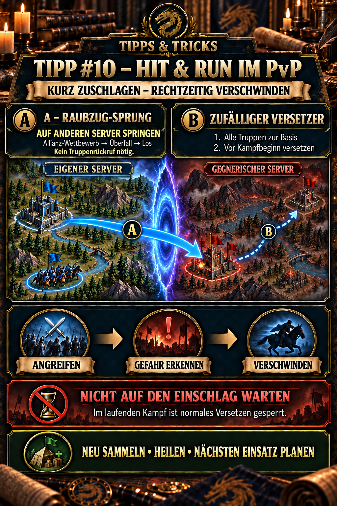

---
arten:
  - Strategie
  - Optimierung
themen:
  - Events
  - Kampf
  - Truppen
  - Weltkarte
---

# 💡 Tipp #10 – Hit & Run im PvP

## Das Wichtigste in Kürze

- **Hit & Run** bedeutet: ein lohnendes Ziel kurz angreifen und die eigene Basis verlagern, bevor der Gegner wirksam zurückschlagen kann.
- Für kleine Allianzen ist das oft sinnvoller, als eine nicht haltbare Position gegen deutlich stärkere Gegner zu verteidigen.
- **Fluchtweg A – Serverwechsel über Raubzug/Überfall:** Der Notausgang funktioniert in beide Richtungen. Kämpft ihr auf dem gegnerischen Server, springt ihr bei Gefahr über **Zurückkehren** nach Hause. Kämpft ihr während der Hauptstadteroberung auf dem eigenen Server, wechselt ihr über **Allianz-Wettbewerb → Überfall → Los** auf den gegnerischen Server. Nach aktueller DIE-Spielerfahrung müssen Truppen außerhalb der Basis dafür nicht vorher zurückgerufen werden.
- **Fluchtweg B – zufälliger Versetzer:** Ruft alle Truppen in die Basis zurück und nutzt den zufälligen Versetzer, bevor der Kampf beginnt. Die neue Randposition ist nicht planbar, trennt euch aber schnell vom bisherigen Gefahrenpunkt.
- Wartet nicht auf den Einschlag. Sobald der Kampf bereits läuft, kann ein normaler Versetzer nicht mehr genutzt werden.
- Nach jeder Verlagerung sofort Position, eingehende Märsche, Schildstatus, Battle Frenzy und Rückwege der eigenen Truppen kontrollieren.

> **Merksatz:** Kurz zuschlagen, Gefahr früh erkennen, rechtzeitig verschwinden.



## Wofür ist dieser Tipp?

Dieser Tipp beschreibt eine mobile PvP-Taktik für Situationen, in denen ein dauerhaftes Halten der eigenen Position zu teuer oder aussichtslos wäre. Das betrifft besonders:

- kleine Allianzen gegen deutlich stärkere Gegner,
- den Raubzug beziehungsweise Überfall im Allianz-Wettbewerb,
- die Hauptstadteroberung im Expeditionswahnsinn,
- offene PvP-Phasen mit vielen eingehenden Angriffen und
- einzelne Angriffe auf schlecht geschützte gegnerische Basen.

Hit & Run ist keine Einladung zu wahllosen Einzelangriffen. Ein Ziel wird nur angegriffen, wenn der mögliche Ertrag das Risiko rechtfertigt und ein funktionierender Fluchtweg vorbereitet ist.

## Das Grundprinzip

```text
Ziel auswählen
      ↓
kurz und kontrolliert angreifen
      ↓
gegnerische Reaktion beobachten
      ↓
rechtzeitig verlagern
      ↓
Lage, Truppen und Schutz neu prüfen
```

Die Taktik tauscht dauerhaftes Halten gegen Beweglichkeit. Ihr gebt dem Gegner möglichst wenig Zeit,

- einen Sammelangriff zu organisieren,
- eure Rückkehrposition zu blockieren,
- eure Basis mehrfach anzugreifen oder
- euch in einen langen, verlustreichen Schlagabtausch zu zwingen.

Der Rückzug ist dabei kein Scheitern. Er ist ein geplanter Teil des Angriffs.

## Vor jedem Angriff: Fluchtweg festlegen

Greift erst an, wenn diese Fragen beantwortet sind:

1. Ist der Raubzug beziehungsweise Überfall aktuell geöffnet?
2. Kämpft ihr gerade auf dem eigenen oder auf dem gegnerischen Server – und welcher Wechsel führt euch aus der Gefahr?
3. Liegt ein zufälliger Versetzer im Inventar?
4. Sind alle normalen Märsche schnell zurückrufbar?
5. Läuft bereits Battle Frenzy oder ein anderer Teleport-Hinderungsstatus?
6. Woran erkennt ihr eine gegnerische Reaktion – eingehender Marsch, Rallyflagge, Auskundschaftung oder Teleport eines starken Spielers?
7. Ab welchem Signal brecht ihr ab, ohne noch „einen letzten Angriff“ zu versuchen?

> **Praxisregel:** Der Fluchtweg wird vor dem Angriff entschieden, nicht erst unter Zeitdruck.

## Fluchtweg A: Über den Raubzug die Serverseite wechseln

Während des Allianz-Wettbewerbs kann der Bereich je nach deutscher Übersetzung als **Raubzug** oder **Überfall** bezeichnet werden. Der Serverwechsel lässt sich als Fluchtweg in beide Richtungen einsetzen:

- **Ihr kämpft auf dem gegnerischen Server:** Nach eurem Angriff nutzt ihr bei Gefahr **Zurückkehren** und springt auf den eigenen Server.
- **Ihr kämpft auf dem eigenen Server:** Das kann besonders während der Hauptstadteroberung passieren. Bei Gefahr nutzt ihr **Allianz-Wettbewerb → Überfall → Los** und springt auf den gegnerischen Server.

Nach aktueller DIE-Spielerfahrung funktioniert dieser serverübergreifende Wechsel auch, wenn sich eigene Truppen außerhalb der Basis befinden. Das macht ihn für einen schnellen Rückzug besonders wertvoll: Ein vollständiger Rückruf ist für diesen Weg nicht erforderlich.

### Ablauf

1. Vor dem Angriff prüfen, auf welcher Serverseite ihr euch befindet und welcher Wechsel als Notausgang bereitsteht.
2. Das vorgesehene Ziel angreifen.
3. Karte und eingehende Märsche beobachten.
4. Bei klarer Gefahr sofort die passende Richtung wählen:
   - **Gegnerischer Server → eigener Server:** **Zurückkehren**.
   - **Eigener Server → gegnerischer Server:** **Allianz-Wettbewerb → Überfall → Los**.
5. Den Serverwechsel bestätigen und die neue Position wählen, soweit das Spiel dies anbietet.
6. Nach dem Wechsel sofort Truppenanzeigen, Rückwege und eingehende Märsche kontrollieren.
7. Erst nach neuer Lagebewertung weiterkämpfen, heilen oder neu sammeln.

### Vorteile

- Kein vorheriger Rückruf aller Truppen erforderlich.
- Nach dokumentierter Spielerfahrung kostenlos.
- Die Servergrenze kann je nach Ausgangsseite in beide Richtungen als Notausgang dienen.
- Auf dem gegnerischen Server lässt sich die Zielposition und bei der Rückkehr auch die neue Heimatposition nach dokumentierter Erfahrung frei wählen.

### Grenzen

- Nur nutzbar, solange der passende Überfall geöffnet und der Sprung erlaubt ist.
- Kampfstatus, Battle Frenzy und Sonderregeln müssen im aktuellen Bestätigungsdialog geprüft werden.
- Nicht öffentlich vollständig dokumentiert ist, wie jeder bereits laufende gegnerische oder eigene Marsch nach dem Sprung behandelt wird.
- Der Zielserver des Raubzugs ist nicht automatisch derselbe Server wie bei einem parallel laufenden anderen Ereignis. Vor der Bestätigung Ziel und Rückweg prüfen.

Die vollständige Hin- und Rückreise beschreibt Tipp #9 – Gratis umziehen per Überfall.

## Fluchtweg B: Truppen zurückrufen und zufälligen Versetzer nutzen

Der zufällige Versetzer bewegt die Basis an eine nicht frei wählbare Position am Rand der Karte. Er ist weniger komfortabel als ein gezielter Teleport, eignet sich aber als günstiger vorbereiteter Notausgang.

Für diesen Ablauf werden die eigenen Truppen zunächst zur Basis zurückgerufen. Erst dann wird der Versetzer eingesetzt.

### Ablauf

1. Weitere Angriffe sofort stoppen.
2. Alle eigenen Teams und Märsche zur Basis zurückrufen.
3. Prüfen, ob der Gegner bereits eingeschlagen hat oder der Kampf läuft.
4. Den **zufälligen Versetzer** öffnen.
5. Teleport bestätigen, bevor der Kampf beginnt.
6. Nach dem Sprung neue Position, Gegner, Schild und Truppen kontrollieren.
7. Bei einer schlechten Randposition nicht reflexartig weitere wertvolle Versetzer verbrauchen; zuerst die neue Gefahr bewerten.

### Vorteile

- Unabhängig vom Überfall verfügbar, sofern ein Item vorhanden ist und Teleportieren erlaubt ist.
- Günstiger als ein fortgeschrittener Versetzer.
- Die zufällige Verlagerung erschwert dem Gegner die unmittelbare Fortsetzung am bisherigen Standort.

### Grenzen

- Alle benötigten Truppen müssen rechtzeitig zurück sein.
- Der Zielort ist nicht planbar und kann weit von Allianz oder Ereignisziel entfernt liegen.
- Während eines bereits laufenden Kampfes ist es für diesen Teleport zu spät.
- Ein eingehender Marsch ist noch kein Freibrief zum Warten: Je kürzer seine Restzeit, desto größer das Risiko, den Teleportzeitpunkt zu verpassen.

Weitere Eigenschaften der drei Versetzer stehen in Tipp #4 – Richtig teleportieren.

## Welcher Fluchtweg passt?

| Situation | Bevorzugter Weg | Warum |
| --- | --- | --- |
| Gefahr nach Angriff auf dem gegnerischen Server | **Zurückkehren** | schneller Wechsel auf den eigenen Server |
| Gefahr nach Kampf auf dem eigenen Server, etwa bei der Hauptstadteroberung | **Überfall → Los** | schneller Wechsel auf den gegnerischen Server |
| Serverwechsel verfügbar, Truppen noch unterwegs | **Raubzug-Sprung** | kein vollständiger Rückruf nötig |
| Überfall nicht verfügbar, alle Truppen zu Hause | **zufälliger Versetzer** | vorbereiteter, günstiger Notausgang |
| Exakte neue Position erforderlich | **fortgeschrittener Versetzer** | nur dieser reguläre Versetzer erlaubt gezielte Platzierung |
| Kampf läuft bereits | **kein normaler Versetzer** | Rückzug wurde zu spät eingeleitet |
| Fluchtweg unklar oder gesperrt | **nicht angreifen** | Hit & Run ohne Run ist nur ein riskanter Angriff |

## Hit & Run bei der Hauptstadteroberung

Für eine kleine Allianz kann Hit & Run eine sinnvolle Ausweichtaktik sein, wenn ein koordinierter Objektivkampf mit festen Raidteams nicht realistisch ist. Den maximalen Einfluss auf Hauptstadt und Batterien erzeugen vorbereitete Raidteams; wer dafür nicht genügend aktive oder starke Spieler stellen kann, kann stattdessen:

- nur eindeutig freigegebene und schwach geschützte Ziele angreifen,
- kurze Punkt- oder Entlastungsangriffe durchführen,
- starke Gegenreaktionen früh erkennen,
- die Basis rechtzeitig per Raubzug-Sprung oder Versetzer verlagern,
- Truppen erhalten und nach dem Rückzug erneut einsetzen.

Diese Taktik ersetzt keine serverweite Einsatzplanung. Sie verhindert aber, dass eine kleine Allianz ihre gesamten Truppen in einer Position verbraucht, die sie realistisch nicht halten kann.

Vor dem Event sollte eindeutig entschieden werden:

- **Objektivplan:** Hauptstadt und Batterien gemeinsam mit dem Server unterstützen.
- **Hit-&-Run-Plan:** Mobile Angriffe, Gegner binden, persönliche Ziele kontrolliert verfolgen und eigene Verluste begrenzen.

Ein Wechsel zwischen beiden Plänen erfolgt nur auf Ansage. Sonst fehlen Spieler am Objektiv, während andere von gemeinsamer Unterstützung ausgehen.

## Abbruchsignale

Spätestens bei einem dieser Signale sollte der Rückzug geprüft werden:

- Ein deutlich stärkerer Spieler teleportiert in unmittelbare Nähe.
- Eine Rallyflagge erscheint auf der eigenen Basis.
- Mehrere gegnerische Märsche starten gleichzeitig.
- Eigene Truppen sind bereits stark beschädigt.
- Der vorgesehene Fluchtweg droht zu schließen.
- Die Einsatzleitung ruft zum Wechsel des Gebiets oder Plans auf.

Nicht jedes Auskundschaften ist automatisch ein Angriff. Bei starkem Kräfteunterschied ist es dennoch oft besser, zu früh als eine Sekunde zu spät zu reagieren.

## Typische Fehler

- **Ohne vorbereiteten Fluchtweg angreifen:** Dann wird aus Hit & Run ein gewöhnlicher riskanter Angriff.
- **Auf den Einschlag warten:** Normale Versetzer funktionieren während des laufenden Kampfes nicht.
- **Für den Raubzug-Sprung unnötig alle Truppen zurückrufen:** Nach aktueller DIE-Erfahrung ist das nicht erforderlich.
- **Beim zufälligen Versetzer Truppen draußen lassen:** Für diesen Ablauf werden sie zuerst zur Basis geholt.
- **„Noch einen Angriff“ starten:** Zusätzliche Sekunden können den sicheren Rückzug kosten.
- **Raubzugziel und Ereignisgegner verwechseln:** Vor jedem serverübergreifenden Sprung Zielserver prüfen.
- **Nach dem Teleport nicht kontrollieren:** Truppenwege, eingehende Märsche, Schild und neue Umgebung sofort ansehen.
- **Hit & Run mit Dauerflucht verwechseln:** Nach der Verlagerung neu sammeln, heilen und den nächsten kontrollierten Einsatz vorbereiten.
- **Objektivgruppe ohne Absprache verlassen:** Mobile Taktik und Objektivplan müssen vorher verteilt sein.

## Grenzen und offene Punkte

- Der Raubzug-Sprung mit Truppen außerhalb der Basis beruht auf aktueller DIE-Spielerfahrung und dem bereits dokumentierten Tipp #9.
- Die Behandlung laufender eigener und gegnerischer Märsche nach einem serverübergreifenden Sprung ist noch nicht für alle Fälle dokumentiert.
- Der zufällige Versetzer ist durch Tipp #4 belegt; welche Zustände außer einem bereits laufenden Kampf die Nutzung sperren, bleibt zu testen.
- Teleportregeln, Abklingzeiten, Zielserver und Eventüberschneidungen können sich durch Updates ändern.
- Ein neuer Standort ist nicht automatisch sicher. Die Karte muss nach jedem Sprung neu bewertet werden.

## Quellen und Verlässlichkeit

- **DIE-Praxiswissen:** Die Kombination aus Raubzug-Sprung bei Gefahr und Rückruf plus zufälligem Versetzer stammt aus aktueller Spielerfahrung der Allianz.
- **Verwandte DIE-Tipps:** Tipp #4 dokumentiert Wirkung und Kampfsperre der regulären Versetzer; Tipp #9 dokumentiert den kostenlosen serverübergreifenden Sprung und seine Nutzung mit Truppen außerhalb der Basis.
- **Community-Einsatzbeschreibung:** [Expedition Frenzy – Zroute Unofficial](https://zroutegame.com/expedition-frenzy/) beschreibt eine mobile „Bouncer“-Rolle: leicht geschützte Ziele angreifen und beim Gegenangriff sofort teleportieren, statt am Ziel zu bleiben.
- **Öffentliche Bestätigung der Serverreise:** [Interserver War bei IMPh](https://imph.info/interserver-war) bestätigt das Teleportieren zum gegnerischen Server während des Allianz-Wettbewerbs, dokumentiert aber nicht alle hier beschriebenen Fluchtvarianten.

**Stand:** 27.09.2026

## Allianz-Mitteilung zum Kopieren

```html
<color=#FFD700><b>💡 TIPP #10 – HIT & RUN IM PvP</b></color>

Greift nur an, wenn euer <b>Fluchtweg bereits feststeht</b>. Bei starker Gegenwehr nicht stehen bleiben!

🌍 <b>WEG A – SERVERWECHSEL:</b> Der Raubzug funktioniert als Notausgang in beide Richtungen: Auf dem Gegner-Server bei Gefahr <b>Zurückkehren</b>. Auf dem eigenen Server – etwa bei der Hauptstadteroberung – über <b>Allianz-Wettbewerb → Überfall → Los</b> zum Gegner springen. Truppen außerhalb der Basis müssen nach aktueller Erfahrung nicht zurückgerufen werden.

❓ <b>WEG B – ZUFÄLLIGER VERSETZER:</b> Alle Truppen zur Basis holen und teleportieren, <b>bevor</b> der Kampf beginnt.

⚠️ <color=#FF4040><b>NICHT AUF DEN EINSCHLAG WARTEN!</b></color> Während des laufenden Kampfes ist ein normaler Versetzer gesperrt.

<color=#7FFF00><b>Kurz zuschlagen → Gefahr erkennen → rechtzeitig verschwinden → neu sammeln.</b></color>
```
