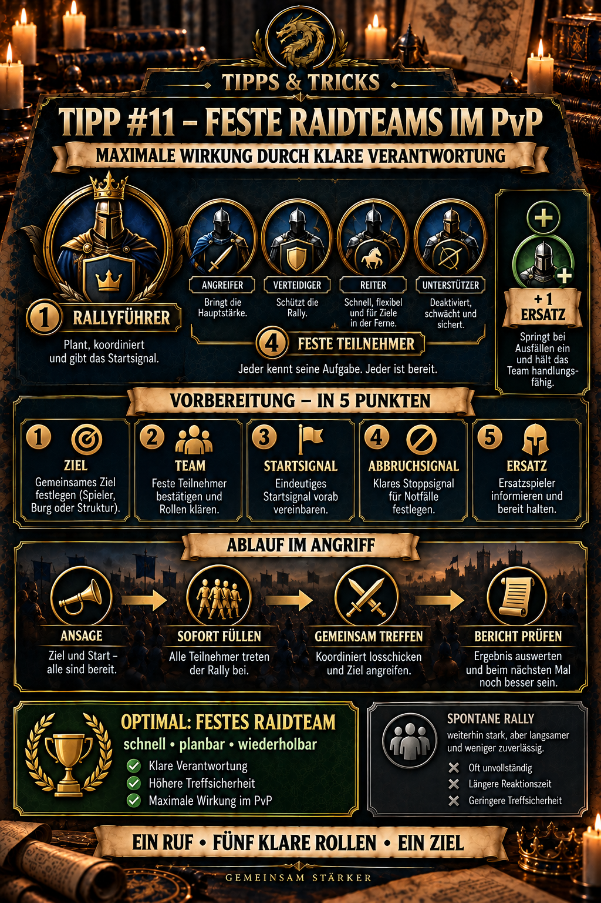

---
arten:
  - Strategie
  - Optimierung
themen:
  - Kampf
  - Allianz
  - Truppen
  - Events
---

# 💡 Tipp #11 – Feste Raidteams im PvP

## Das Wichtigste in Kürze

- Ein **Raidteam** besteht organisatorisch aus einem verantwortlichen Rallyführer und vier fest zugeordneten Teilnehmern.
- Feste Gruppen sind die optimale Form des Sammelangriffs: Jeder kennt Ziel, Team, Startsignal, Abbruchsignal und seine Verantwortung.
- Der Rallyführer eröffnet nicht nur die Rally. Er prüft Ziel und Timing, gibt die Formation vor und entscheidet nach dem Kampf über Wiederholung, Wechsel oder Rückzug.
- Die vier Teilnehmer halten ihr vereinbartes PvP-Team und einen Marschplatz frei, treten sofort bei und tauschen ihre Aufstellung nicht eigenmächtig aus.
- Mindestens ein Ersatzspieler je Raidteam verhindert, dass der gesamte Ablauf beim Ausfall eines Mitglieds stehen bleibt.
- Auch ein spontan gefüllter Sammelangriff kann stark sein und gewinnen. Ohne feste Zuständigkeiten dauert das Füllen meist länger, die Teamqualität schwankt und Folgeangriffe lassen sich schlechter planen.
- Nach jedem wichtigen Angriff wird der Kampfbericht kurz ausgewertet. Dann wird möglichst nur eine Änderung vorgenommen.

> **Merksatz:** Ein Ruf, fünf klare Rollen, ein gemeinsames Ziel.



## Was ist ein festes Raidteam?

Ein festes Raidteam ist eine vorbereitete Gruppe für PvP-Sammelangriffe. Die fünf Personen gehören für den Einsatz verbindlich zusammen:

1. **ein Rallyführer**, der den Angriff verantwortlich eröffnet und steuert,
2. **vier feste Teilnehmer**, die mit vereinbarten Teams sofort beitreten.

Die Fünfergruppe ist ein **Organisationsmodell der Allianz**. Sie beschreibt die klare Zuständigkeit und nicht automatisch eine allgemeingültige technische Obergrenze des Spiels. Falls die aktuelle Rallykapazität oder ein Ereignis andere Werte anzeigt, gilt immer die Ingame-Anzeige.

Tipp #2 erklärt die grundlegende Mechanik von Sammelangriffen. Dieser Tipp setzt darauf auf und beantwortet die organisatorische Frage: Wie wird aus einer möglichen Rally ein schneller, wiederholbarer PvP-Ablauf?

## Warum feste Teams besser funktionieren

Bei einer spontanen Rally beginnt nach dem Start oft erst die eigentliche Organisation:

- Wer ist online?
- Wer hat einen Marschplatz frei?
- Welches Team soll beitreten?
- Ist die Formation für dieses Ziel geeignet?
- Wer ersetzt einen Ausfall?
- Wer eröffnet den nächsten Angriff?

Diese Rückfragen kosten Zeit. Der Gegner kann verstärken, heilen, teleportieren oder einen Gegenangriff vorbereiten.

Ein festes Raidteam beantwortet diese Fragen bereits vor dem Einsatz. Dadurch entstehen vier Vorteile:

| Vorteil | Wirkung |
| --- | --- |
| **Geschwindigkeit** | Die Rally wird nach dem Signal ohne lange Suche gefüllt. |
| **Planbarkeit** | Stärke, Helden und ungefähre Truppenmenge der Gruppe sind bekannt. |
| **Verantwortung** | Eine Person entscheidet; vier Personen wissen, was von ihnen erwartet wird. |
| **Wiederholbarkeit** | Nach Bericht und Heilung kann dieselbe Gruppe schnell erneut eingesetzt werden. |

Für maximalen Effekt sind feste Raidteams deshalb die beste Anwendung der Sammelangriffstaktik.

## Die fünf Rollen

### 1. Rallyführer

Der Rallyführer trägt die operative Verantwortung. Er:

- prüft Ziel, Garnison und gegnerische Aktivität,
- stimmt den Angriff mit der Einsatzleitung ab,
- nennt das freigegebene Team oder die gewünschte Teamart,
- startet erst, wenn Teilnehmer und Ersatz erreichbar sind,
- gibt Start-, Abbruch- und Wiederholungssignal,
- liest anschließend den Kampfbericht und
- meldet, ob geheilt, gewechselt oder erneut angegriffen wird.

Der stärkste Spieler ist häufig ein guter Rallyführer, aber Stärke allein genügt nicht. Zuverlässigkeit, Übersicht und klare Kommunikation sind ebenso wichtig.

### 2 bis 5. Feste Teilnehmer

Jeder Teilnehmer:

- hält zum vereinbarten Zeitpunkt einen Marschplatz frei,
- nutzt das vorab festgelegte PvP-Team,
- tritt nur der freigegebenen Rally bei,
- verändert Helden oder Formation nicht ohne Rücksprache,
- meldet sofort, wenn Truppen, Heilung oder Onlinezeit nicht reichen,
- wartet nach dem Angriff auf die nächste Ansage.

Ein schwächerer, aber verlässlicher Teilnehmer ist häufig wertvoller als ein stärkerer Spieler, der erst nach mehreren Aufrufen reagiert.

### Ersatzspieler

Ein Ersatzspieler gehört nicht zu den fünf festen Plätzen, kennt aber denselben Ablauf. Er springt ein, wenn jemand ausfällt, noch heilt oder einen Marschplatz nicht rechtzeitig freibekommt.

Ohne vorher benannten Ersatz entsteht genau die Verzögerung, die das feste Raidteam vermeiden soll.

## Die Raidkarte vor dem Kampf

Für jedes Raidteam reicht eine kurze, kopierbare Einsatzkarte:

```text
RAIDTEAM A
Rallyführer: [Name]
Teilnehmer: [Name 1] / [Name 2] / [Name 3] / [Name 4]
Ersatz: [Name]
Primärziel: [Ziel oder Zielart]
Teamvorgabe: [Hauptteam / Fraktion / freigegebene Formation]
Startsignal: [kurzes Wort oder Symbol]
Abbruchsignal: [kurzes Wort oder Symbol]
Sammelkanal: [Allianzchat / eigener Chat]
```

Je kürzer und eindeutiger die Signale, desto weniger Missverständnisse entstehen mitten im Kampf.

## Optimaler Ablauf eines Angriffs

### 1. Ziel freigeben

Die Einsatzleitung oder der Rallyführer markiert genau ein Ziel. Keine zweite Person startet gleichzeitig eine konkurrierende Rally mit denselben Teilnehmern.

### 2. Bereitschaft bestätigen

Die vier festen Teilnehmer bestätigen kurz. Wer nicht bereit ist, meldet das sofort; der Ersatzspieler übernimmt.

### 3. Rally starten und sofort füllen

Der Rallyführer startet. Die vier vorgesehenen Spieler treten mit dem vereinbarten Team bei. Andere Mitglieder füllen nicht ungefragt einen reservierten Platz.

### 4. Einschlag und Gegenreaktion beobachten

Während der Angriff läuft, beobachtet die Einsatzleitung Verstärkungen, eingehende Märsche und mögliche Gegenangriffe. Das Raidteam beginnt nicht parallel eine andere Aktion.

### 5. Bericht lesen

Nach dem Einschlag werden mindestens diese Punkte geprüft:

- eingesetzte und verlorene Soldaten,
- gegnerische Formation und Fraktionskonter,
- Schaden, erlittener Schaden und Heilung,
- erkennbare Entwicklungsunterschiede,
- bei Basisverteidigung ein möglicher Durchbruch und zusätzliche Tote im Übungsplatz.

Die vollständige Auswertung erklärt Tipp #12 – Kampfberichte richtig lesen.

### 6. Klare Folgeentscheidung

Der Rallyführer gibt genau eine nächste Aktion aus:

- **WIEDERHOLEN** – gleiche Gruppe, gleiches Ziel,
- **ANPASSEN** – eine festgelegte Änderung testen,
- **WECHSELN** – nächstes Raidteam übernimmt,
- **HEILEN** – Gruppe stellt Einsatzbereitschaft wieder her,
- **ABBRUCH** – Ziel oder Lage rechtfertigt keinen weiteren Angriff.

## Mehrere Raidteams organisieren

Große und aktive Allianzen sollten nicht eine einzige Gruppe überlasten, sondern mehrere feste Teams bilden:

| Gruppe | mögliche Aufgabe |
| --- | --- |
| **Raidteam A** | stärkstes Ziel oder gegnerische Hauptgarnison brechen |
| **Raidteam B** | Folgeangriff, Gegenangriff oder zweites Objektiv |
| **Raidteam C** | Reserve, Ablösung oder Schutz wichtiger Spieler |

Die Einsatzleitung verteilt Ziele und verhindert, dass sich Gruppen gegenseitig Teilnehmer wegnehmen. Bei der Hauptstadteroberung können beispielsweise ein Team für die Hauptstadt und weitere Teams für priorisierte Batterien vorgesehen werden.

## Wenn keine vollständige Fünfergruppe verfügbar ist

Ein fester Fünfer ist das Optimum, aber nicht jede Allianz kann ihn zu jedem Zeitpunkt vollständig stellen. Dann gilt:

1. verfügbare Kernspieler benennen,
2. Ziel und Teamvorgabe trotzdem klar ansagen,
3. vor dem Start gezielt nach fehlenden Plätzen suchen,
4. mehr Zeit für Füllung und Prüfung einplanen,
5. nach dem Angriff neu bestätigen, wer für die nächste Rally bereitsteht.

Ein solcher Sammelangriff kann weiterhin sehr stark sein. Er ist nur weniger schnell und weniger zuverlässig reproduzierbar. Das Ziel bleibt, aus wiederkehrenden spontanen Teilnehmern schrittweise feste Raidteams zu bilden.

Wenn selbst dafür nicht genügend Stärke oder Aktivität vorhanden ist und eine Stellung nicht gehalten werden kann, ist Tipp #10 – Hit & Run im PvP die passendere Ausweichtaktik.

## Typische Fehler

- **Rally erst starten, dann Teilnehmer suchen:** Der Gegner erhält unnötig viel Reaktionszeit.
- **Keine feste Führung:** Mehrere Ansagen erzeugen konkurrierende Ziele und leere Rallys.
- **Teilnehmer wechseln eigenmächtig das Team:** Die geplante Gesamtstärke und Rollenverteilung bricht auf.
- **Starke Spieler in mehreren Gruppen einplanen:** Zwei Raidteams rechnen gleichzeitig mit derselben Person.
- **Keinen Ersatz benennen:** Ein Ausfall stoppt den gesamten Ablauf.
- **Nach einem Sieg blind wiederholen:** Der Gegner kann Formation, Garnison oder Verstärkung geändert haben.
- **Nach einer Niederlage alles ändern:** Dann zeigt der nächste Bericht nicht, welche Anpassung tatsächlich geholfen hat.
- **Persönliche Ziele vor die Gruppenzusage stellen:** Ein fest zugesagter Teilnehmer muss seinen Marschplatz für das Raidteam verfügbar halten.

## Kompakte Checkliste

### Vor dem Einsatz

- [ ] Rallyführer benannt
- [ ] vier feste Teilnehmer bestätigt
- [ ] mindestens ein Ersatzspieler festgelegt
- [ ] Primärziel und Alternativziel definiert
- [ ] freigegebenes Team oder Formation vereinbart
- [ ] Start- und Abbruchsignal bekannt
- [ ] Marschplätze und Truppen verfügbar
- [ ] Heilung und Rückzug vorbereitet

### Während des Einsatzes

- [ ] nur der verantwortliche Rallyführer startet
- [ ] feste Teilnehmer füllen sofort
- [ ] Ersatz rückt nur auf Ansage nach
- [ ] gegnerische Verstärkungen und Gegenmärsche melden
- [ ] nach dem Bericht genau eine Folgeentscheidung treffen

## Quellen und Einordnung

- **Verwandte DIE-Tipps:** Tipp #2 erklärt Sammelangriffe und Tipp #10 Hit & Run als Ausweichtaktik. Tipp #12 behandelt die Auswertung der Kampfberichte; Tipp #13 setzt Raidteams bei der Hauptstadteroberung ein.
- **Community-Dokumentation zum serverübergreifenden Kampf:** [Expedition Frenzy – Zroute Unofficial](https://zroutegame.com/expedition-frenzy/) – beschreibt die gemeinsame Zielkoordination und die Grenzen allianzübergreifender Rallyteilnahme.
- Die feste Fünferstruktur, Verantwortlichkeiten und Einsatzkarten sind eine **DIE-Organisationsempfehlung** für schnelle und wiederholbare PvP-Rallys. Aktuelle Ingame-Limits und Ereignisregeln haben Vorrang.

**Stand:** 27.09.2026

## Allianz-Mitteilung zum Kopieren

```html
<color=#FFD700><b>💡 TIPP #11 – FESTE RAIDTEAMS</b></color>

Für maximale Wirkung kämpfen wir mit <b>festen Fünfergruppen</b>:

👑 <b>1 Rallyführer</b> prüft Ziel und Timing, startet die Rally und entscheidet danach über Wiederholung, Wechsel oder Abbruch.

⚔️ <b>4 feste Teilnehmer</b> halten ihr vereinbartes PvP-Team und einen Marschplatz frei. Nach dem Start sofort beitreten – keine eigenmächtigen Teamwechsel.

🔄 <b>1 Ersatzspieler</b> wird vorab benannt und rückt nur auf Ansage nach.

Spontane starke Rallys sind weiterhin möglich, brauchen aber mehr Zeit und liefern weniger zuverlässig das optimale Ergebnis.

<color=#7FFF00><b>Ein Ruf – fünf klare Rollen – ein gemeinsames Ziel!</b></color>
```
