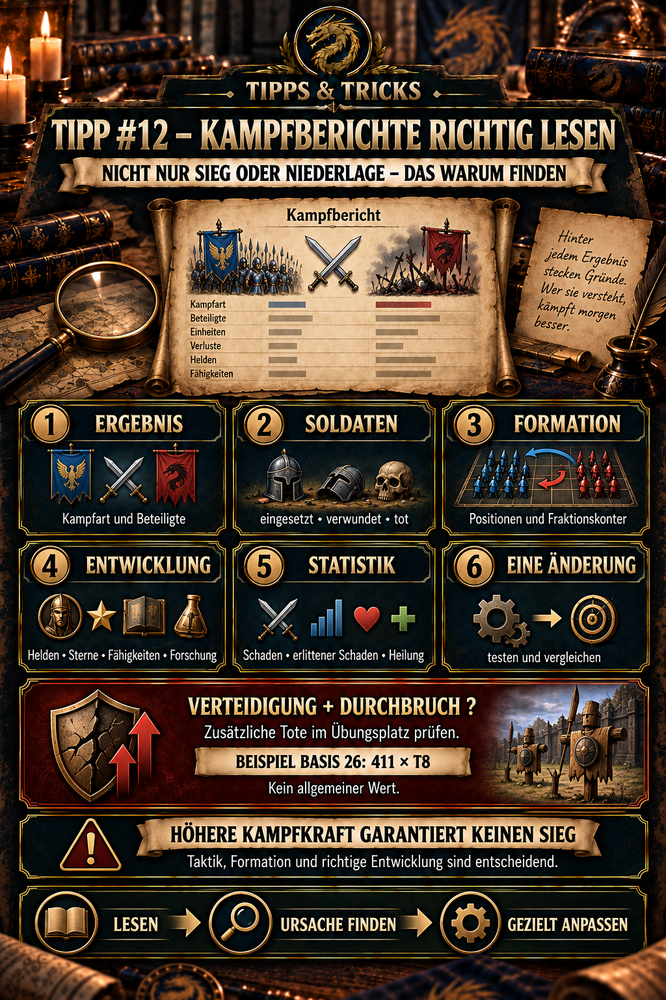

---
arten:
  - Anleitung
  - Optimierung
themen:
  - Kampf
  - Truppen
---

# 💡 Tipp #12 – Kampfberichte richtig lesen

## Das Wichtigste in Kürze

- Ein Sieg oder eine Niederlage sagt nur, **was** passiert ist. Der vollständige Kampfbericht hilft zu verstehen, **warum** es passiert ist.
- Prüft zuerst Kampfart, Angreifer, Verteidiger und eingesetzte Teams. Ein Einzelangriff, Sammelangriff und eine Garnisonsverteidigung sind nicht direkt vergleichbar.
- Vergleicht danach Soldaten: eingesetzt, überlebend, leicht verwundet, verwundet und tot. Die genaue Behandlung hängt von Kampfart und Spielmodus ab.
- Prüft bei einer Verteidigung mit **Durchbruch** zusätzlich die Verluste im Übungsplatz. Diese können getrennt von den eingesetzten Verteidigungsteams ausgewiesen werden.
- Kontrolliert Helden, Positionen und Fraktionskonter. Eine höhere Gesamtkampfkraft garantiert keinen günstigen Kampf.
- Nutzt die Entwicklungsdetails beider Seiten, um Unterschiede bei Helden, Sternen, Fähigkeiten, Ausrüstung, Forschung und weiteren Verstärkungen zu erkennen.
- Bewertet Schaden, erlittenen Schaden und Heilung nach der Rolle eines Helden. Ein Tank muss nicht den höchsten Schaden verursachen, um entscheidend zu sein.
- Ändert für den nächsten Test möglichst **nur eine Sache**. Sonst lässt sich nicht erkennen, was den Unterschied gemacht hat.

> **Merksatz:** Ergebnis → Truppen → Formation → Entwicklung → Statistik → eine Änderung testen.



## Wofür ist dieser Tipp?

Kampfberichte sind keine bloßen Siegesmeldungen. Sie sind das wichtigste Werkzeug, um eine Formation gezielt zu verbessern, unerwartete Niederlagen zu erklären und teure Fehlentscheidungen nicht zu wiederholen.

Dieser Tipp hilft bei Fragen wie:

- Warum hat ein Team mit höherer Kampfkraft verloren?
- Ist die Frontlinie zu schwach oder fehlt Schaden?
- Stand ein Held auf der falschen Position?
- Hat ein Fraktionskonter das Ergebnis beeinflusst?
- Welche Entwicklungskomponente unterscheidet beide Seiten?
- Ist ein schlechtes Ergebnis ein Aufstellungsproblem oder nur der falsche Vergleich?
- Welche einzelne Änderung sollte als Nächstes getestet werden?

Die genaue Darstellung kann je nach Kampfart und Spielversion variieren. Die Lesereihenfolge bleibt trotzdem dieselbe.

## Die sechs Schritte

```text
1. Kontext und Ergebnis
          ↓
2. Truppenstatus
          ↓
3. Helden, Positionen und Konter
          ↓
4. Entwicklungsdetails
          ↓
5. Kampfstatistik und Verlauf
          ↓
6. Eine Änderung festlegen und erneut testen
```

Wer direkt zu einzelnen Schadenswerten springt, übersieht leicht den eigentlichen Grund. Ein Held kann wenig Schaden verursachen, weil die Front zu früh gefallen ist – oder weil seine Aufgabe Schutz und Heilung statt Schaden war.

## 1. Kontext und Ergebnis prüfen

Notiert zuerst die Rahmenbedingungen:

- Welche Kampfart war es?
- Wer hat angegriffen und wer verteidigt?
- War es ein Einzelangriff, ein Sammelangriff oder eine Garnison?
- Haben mehrere vollständige Teams nacheinander gekämpft?
- Gab es aktive Event-, Amts-, Forschungs- oder andere Kampfboni?
- Waren beide Teams vor dem Kampf vollständig aufgefüllt?

Erst danach betrachtet ihr Sieg oder Niederlage. Das Ergebnis beantwortet nur die erste Frage:

> **Welche Seite hatte am Ende noch ein kampffähiges Team?**

Es beantwortet nicht automatisch, welche Formation langfristig besser ist. Ein bereits beschädigtes Team, ein Konter oder ein aktiver Bonus kann einen einzelnen Vergleich stark beeinflussen.

### Bei Sammelangriffen besonders wichtig

Ein Sammelangriffsbericht kann mehrere Begegnungen enthalten. Prüft deshalb:

- welches Team auf A1, A2, A3 beziehungsweise V1, V2, V3 stand,
- wer in der ersten Runde gegen wen kämpfte,
- welcher Gewinner beschädigt in die nächste Runde ging und
- welche Teams gar nicht mehr eingesetzt wurden.

Die vollständige Paarungslogik findet ihr in Tipp #2 – Sammelangriffe.

## 2. Truppenstatus lesen

Die wichtigsten Truppenzeilen sind typischerweise:

| Anzeige | Bedeutung für die Auswertung |
| --- | --- |
| Eingesetzt | Wie viele Soldaten tatsächlich in diesen Kampf gingen |
| Überlebend | Wie viele ohne ausgewiesenen Verwundetenstatus zurückbleiben |
| Leicht verwundet | Beschädigte Soldaten, deren Behandlung je nach Kampfart abweichen kann |
| Verwundet | Soldaten, die in der Regel im Krankenhaus beziehungsweise im passenden Heilungssystem landen |
| Tot | dauerhaft verlorene Soldaten, sofern der jeweilige Modus keine Sonderregel besitzt |

Die Begriffe dürfen nicht ohne den Spielmodus interpretiert werden. Manche Ereignisse arbeiten mit eigenen Truppen, Sonderkrankenhäusern oder abweichenden Verlustregeln. Prüft deshalb zuerst die Ereignisregeln.

### Besonderheit bei der Basisverteidigung: Durchbruch und Übungsplatz

Bei einer Basisverteidigung kann der Bericht nach einem **Durchbruch** zusätzliche getötete Soldaten aus dem Übungsplatz anzeigen. Diese Zeile darf nicht mit den Verlusten der unmittelbar eingesetzten Verteidigungsteams verwechselt oder übersehen werden.

Für die Auswertung bedeutet das:

1. Zuerst die normalen Kampfverluste der eingesetzten Teams lesen.
2. Prüfen, ob der Bericht einen Durchbruch ausweist.
3. Die zusätzlich im Übungsplatz getöteten Soldaten separat notieren.
4. Erst danach den gesamten Schaden des Angriffs bewerten.

**Beobachtetes DIE-Beispiel:** Bei einer Basis auf **Level 26** wurden nach einem Durchbruch zusätzlich **411 T8-Soldaten** im Übungsplatz als getötet ausgewiesen.

Dieser Wert ist ein konkretes Spielerbeispiel und keine allgemeine Formel. Noch offen ist, wovon die Zahl genau abhängt – etwa Basislevel, Übungsplatz, vorhandener Truppenbestand, Soldatenstufe oder weitere Verteidigungswerte. Der aktuelle Bericht ist deshalb maßgeblich.

> **Wichtig:** Ein scheinbar kleiner Verlust des sichtbaren Verteidigungsteams kann durch zusätzliche Übungsplatzverluste deutlich teurer sein.

### Nicht nur die absolute Zahl vergleichen

`1.000 Verwundete` sind ohne Bezugsgröße wenig aussagekräftig:

- 1.000 von 10.000 eingesetzten Soldaten entsprechen 10 %.
- 1.000 von 100.000 entsprechen nur 1 %.

Für faire Vergleiche hilft die Verlustquote:

```text
Verlustquote = (leicht verwundet + verwundet + tot) / eingesetzte Soldaten × 100
```

Diese einfache Quote ist keine offizielle Spielkennzahl. Sie ist eine eigene Auswertungshilfe. Je nach Zweck kann es sinnvoll sein, Tote getrennt zu betrachten, weil dauerhafte Verluste schwerer wiegen als heilbare Verwundete.

### Beispiel

| Team | eingesetzt | nicht mehr unversehrt | Quote |
| --- | ---: | ---: | ---: |
| A | 80.000 | 12.000 | 15 % |
| B | 50.000 | 10.000 | 20 % |

Team A hat absolut mehr betroffene Soldaten, aber relativ den besseren Austausch. Das Beispiel dient nur zur Erklärung der Rechnung und bildet keinen konkreten Ingame-Kampf ab.

## 3. Helden, Positionen und Fraktionskonter prüfen

Schaut euch beide Formationen nebeneinander an:

- Welche fünf Helden wurden eingesetzt?
- Wer stand vorne und wer hinten?
- Entspricht die Position der vorgesehenen Rolle?
- Welche Fraktionen trafen aufeinander?
- War ein Konterindikator sichtbar?
- War die Formation vollständig oder fehlten Soldaten beziehungsweise Helden?

### Frontlinie

Vordere Helden sollen Zeit kaufen und die hintere Reihe schützen. Hinweise auf ein Frontproblem:

- ein Frontheld fällt deutlich früher als sein Gegenüber,
- die hintere Reihe erhält sehr früh hohen Schaden,
- ein Schadensheld wurde vorne aufgestellt und erreicht seine Wirkung nicht,
- der Tank besitzt deutlich schwächere Entwicklung als der Rest des Teams.

### Hintere Reihe

Die hintere Reihe liefert meist Schaden, Unterstützung oder Heilung. Hinweise auf ein Problem:

- das Team überlebt lange, verliert aber durch Zeitablauf oder zu wenig Schaden,
- ein Hauptschadensheld verursacht überraschend wenig Schaden,
- Unterstützungsfähigkeiten erreichen nicht die vorgesehenen Verbündeten,
- die Formation wird durch einen ungünstigen Fraktionskonter geschwächt.

### Konter vor Kampfkraft

Die angezeigte Kampfkraft fasst viele Entwicklungen zusammen, bildet aber das konkrete Duell nicht vollständig ab. Fraktionsvorteile, Heldenfähigkeiten, Zielauswahl, Positionen und aktive Boni können einen nominellen Kraftvorsprung ausgleichen oder umdrehen.

> **Praxisregel:** Bei einer unerwarteten Niederlage zuerst Formation und Konter prüfen – nicht sofort wahllos weiter aufwerten.

## 4. Entwicklungsdetails vergleichen

Seit einem Update vom 5. August 2026 zeigen Kampfberichte nach der öffentlich dokumentierten Versionshistorie Entwicklungsdetails für beide Seiten. Je nach Bericht können darunter unter anderem sichtbar oder ableitbar sein:

- Heldenlevel und Sternstufen,
- Fähigkeiten beziehungsweise Skill-Entwicklung,
- Heldenausrüstung,
- Soldatenstufe und Truppenmenge,
- relevante Forschung,
- Jet, Wingmen oder vergleichbare Verstärkungssysteme sowie
- weitere dauerhafte Entwicklungsboni.

Vergleicht nicht jede Zahl gleichzeitig. Sucht zuerst den größten plausiblen Unterschied:

| Beobachtung | mögliche Ursache | nächster sinnvoller Test |
| --- | --- | --- |
| Front fällt früh | Tank, Ausrüstung, Position oder Forschung zu schwach | stärkeren Fronthelden oder bessere Frontausrüstung testen |
| Team überlebt, verursacht aber zu wenig Schaden | Hauptschadensheld oder offensive Skills schwach | einen Schadensfaktor gezielt verbessern |
| ähnliche Helden, deutlich andere Soldatenleistung | Soldatenstufe, Menge oder Forschung | Soldaten- und Forschungsdetails vergleichen |
| höhere Kraft verliert klar | Konter, Formation, Boni oder Vorschaden | mit gleicher Ausgangslage und verändertem Matchup testen |
| ein Held bleibt wirkungslos | falsche Position oder unpassende Synergie | Position beziehungsweise Teamzusammensetzung ändern |

Die Tabelle liefert Diagnosen, keine automatischen Beweise. Ein Bericht zeigt eine konkrete Begegnung. Wiederholte Berichte unter ähnlichen Bedingungen machen eine Vermutung belastbarer.

## 5. Kampfstatistik nach Rollen bewerten

Wenn der Bericht Einzelwerte ausweist, betrachtet mindestens:

- **verursachten Schaden,**
- **erlittenen Schaden,**
- **Heilung oder Schilde,** sofern angezeigt,
- **verbleibende Truppen beziehungsweise Lebensdauer** und
- **Zeitpunkt des Ausscheidens,** soweit aus Verlauf oder Wiederholung erkennbar.

### Schaden

Hoher Schaden ist für Schadenshelden wichtig. Ein hoher Wert beweist aber nicht automatisch, dass die gesamte Formation gut funktioniert. Ein Held kann viel Schaden verursachen und trotzdem zu spät wirken, während die Front bereits zusammenbricht.

### Erlittener Schaden

Bei einem Tank kann ein hoher erlittener Schaden positiv sein, wenn er lange genug überlebt und dadurch die Hinterreihe schützt. Fällt er sofort, war der gleiche Wert möglicherweise nur Ausdruck einer zu schwachen Front.

### Heilung und Schilde

Unterstützer werden leicht unterschätzt, wenn nur Schaden verglichen wird. Entscheidend ist, ob ihre Heilung oder Abschirmung den richtigen Verbündeten erreicht und zusätzliche Kampfzeit schafft.

### Der niedrigste Wert ist nicht automatisch der Fehler

Vergleicht jeden Helden mit seiner Aufgabe. Tanks, Unterstützer und Schadenshelden benötigen unterschiedliche Kennzahlen. Ein Team aus fünf vermeintlichen Schadenshelden kann auf dem Papier stark aussehen und trotzdem verlieren, weil Schutz oder Synergie fehlen.

## 6. Eine Änderung testen

Nach der Auswertung formuliert ihr genau eine Arbeitshypothese:

- „Mein vorderer Schadensheld muss nach hinten.“
- „Der gegnerische Fraktionskonter ist wahrscheinlich entscheidend.“
- „Meine Front hält, aber der Hauptschadensheld ist zu schwach entwickelt.“
- „Das Team war bereits beschädigt; ich brauche einen Vergleich mit voller Truppenstärke.“
- „Im Sammelangriff stand mein bestes Team an der falschen Position.“

Ändert anschließend nur einen gut kontrollierbaren Faktor und vergleicht den nächsten Bericht. Werden Formation, Ausrüstung, Skills, Forschung und Gegner gleichzeitig verändert, lässt sich keine Ursache mehr zuordnen.

## Eine schnelle Diagnosematrix

| Im Bericht sichtbar | zuerst prüfen | nicht vorschnell annehmen |
| --- | --- | --- |
| Niederlage trotz höherer Kraft | Fraktionskonter, Position, Boni, Vorschaden | „Die Kampfkraftanzeige ist falsch“ |
| Front fällt sehr früh | Fronthelden, Ausrüstung, Defensive, Soldaten | „Es fehlt nur mehr Schaden“ |
| Kampf läuft lange, endet aber mit Niederlage | Schadensleistung, Heilung, Zeitlimit | „Der Tank ist zu schwach“ |
| Hauptschadensheld macht wenig Schaden | Position, Überlebenszeit, Zielauswahl, Skills | „Der Held ist grundsätzlich schlecht“ |
| viele Verwundete bei einem Sieg | Verlustquote, Gegner, Kampfzweck | „Ein Sieg war automatisch effizient“ |
| Team kämpft mehrfach | Reihenfolge und Vorschaden | „Alle Kämpfe hatten dieselbe Ausgangslage“ |
| Verteidigung meldet Durchbruch | zusätzliche Übungsplatzverluste | „Nur die sichtbaren Teamverluste zählen“ |

## Berichte sinnvoll teilen

Kampfberichte können laut den dokumentierten Updates direkt in Chatgruppen geteilt werden. Nutzt diese Funktion nicht nur nach Niederlagen.

Eine gute Bitte um Auswertung enthält:

1. den geteilten Bericht,
2. die konkrete Frage,
3. die erwartete Ursache und
4. die Information, ob aktive Boni oder Vorschäden vorhanden waren.

Beispiel:

> „Warum fällt mein linker Frontheld so früh? Beide Teams waren voll. Ich vermute eine falsche Position oder schwächere Frontausrüstung.“

Das ist hilfreicher als nur: „Warum habe ich verloren?“

## Typische Fehler

- **Nur Sieg oder Niederlage ansehen:** Das Ergebnis erklärt keine Ursache.
- **Nur die Gesamtkampfkraft vergleichen:** Konter, Rollen und Boni werden dadurch übersehen.
- **Absolute Verluste ohne Truppenmenge bewerten:** Erst der Anteil macht unterschiedliche Teamgrößen vergleichbar.
- **Tote und Verwundete gleich behandeln:** Ihre Folgen können je nach Modus sehr verschieden sein.
- **Übungsplatzverluste nach einem Durchbruch übersehen:** Bei einer Basisverteidigung kann eine zusätzliche Verlustzeile erscheinen.
- **Den niedrigsten Schadenswert bestrafen:** Ein Tank oder Unterstützer hat eine andere Aufgabe.
- **Mehrere Kampfrunden vermischen:** Spätere Siegerteams können bereits Vorschaden tragen.
- **Verschiedene Spielmodi direkt vergleichen:** Verlust- und Heilungsregeln können abweichen.
- **Alles gleichzeitig verändern:** Danach ist nicht erkennbar, welche Änderung geholfen hat.
- **Einen Bericht als endgültigen Beweis ansehen:** Wiederholbare Muster sind belastbarer als ein einzelner Kampf.
- **Nur Niederlagen untersuchen:** Auch ein teurer Sieg kann eine schlechte Formation offenbaren.

## Checkliste für jeden Kampfbericht

- [ ] Kampfart und Ziel verstanden
- [ ] Angreifer und Verteidiger richtig zugeordnet
- [ ] vollständige Teams und mögliche Vorschäden geprüft
- [ ] eingesetzte, überlebende, verwundete und tote Soldaten verglichen
- [ ] bei einer Verteidigung Durchbruch und zusätzliche Übungsplatzverluste geprüft
- [ ] Verlustanteil statt nur absolute Zahl betrachtet
- [ ] Heldenpositionen und Rollen kontrolliert
- [ ] Fraktionskonter geprüft
- [ ] Entwicklungsdetails beider Seiten verglichen
- [ ] Schaden, erlittenen Schaden und Heilung nach Rolle bewertet
- [ ] bei Sammelangriffen die Paarungsreihenfolge geprüft
- [ ] genau eine Änderung für den nächsten Test festgelegt

## Grenzen und offene Punkte

- Nicht jede Kampfart zeigt dieselben Detailseiten und Kennzahlen.
- Die genaue Benutzeroberfläche kann sich durch Updates ändern.
- Aus einem statischen Bericht ist der zeitliche Kampfverlauf möglicherweise nur eingeschränkt erkennbar.
- Zufallseffekte, Zielauswahl und Fähigkeitenauslösungen können einzelne Ergebnisse beeinflussen.
- Aktive Boni oder vorherige Beschädigungen sind nicht in jeder Ansicht sofort erkennbar.
- Die Beispiel-Verlustquote ist eine eigene Rechenhilfe und keine offizielle Ingame-Wertung.
- Das Beispiel mit 411 getöteten T8-Soldaten stammt aus einer einzelnen DIE-Beobachtung bei Basislevel 26 und darf nicht auf andere Basen hochgerechnet werden.

Bei widersprüchlichen Anzeigen gilt der aktuelle Bericht im Spiel. Für belastbare Vergleiche sollten Ausgangslage, Gegner und veränderte Variable dokumentiert werden.

## Quellen und Verlässlichkeit

- **Aktuelle Versionshistorie:** [Z Route Academy – Updates](https://zroute.dev/updates/) dokumentiert für den 5. August 2026 Entwicklungsdetails beider Seiten im Kampfbericht und für den 29. Juli 2026 das direkte Teilen von Kampfberichten in Chatgruppen.
- **Formation und Entwicklung:** [Z Route Academy – Squad Leveling & Composition](https://zroute.dev/getting-started/squad-leveling-composition/) empfiehlt, schwierige Kämpfe über Berichte auszuwerten und dabei unter anderem schwache Tanks, falsch verteilte Ausrüstung und unpassende Positionen zu suchen.
- **Heldenrollen und Konter:** [Z Route Academy – Hero Progression](https://zroute.dev/heroes/hero-progression/) beschreibt Front- und Hinterreihe, Fraktionskonter und die Unterscheidung zwischen fehlender Überlebensfähigkeit und fehlendem Schaden.
- **DIE-Praxiswissen:** Tipp #2 dokumentiert die Reihenfolge mehrerer Begegnungen im Sammelangriff; Tipp #7 enthält ein konkretes Beispiel für unterschiedliche Verluste bei starken und kleinen Teams.
- **DIE-Ingame-Beobachtung:** Nach einem Durchbruch bei der Verteidigung einer Basis auf Level 26 zeigte der Bericht zusätzlich 411 getötete T8-Soldaten im Übungsplatz. Abhängigkeiten und Berechnungsformel sind noch offen.

**Stand:** 27.09.2026

## Allianz-Mitteilung zum Kopieren

```html
<color=#FFD700><b>💡 TIPP #12 – KAMPFBERICHTE LESEN</b></color>

Ein Sieg oder eine Niederlage zeigt nur, <b>was</b> passiert ist. Der Bericht zeigt, <b>warum</b>.

1️⃣ <b>KONTEXT:</b> Einzelangriff, Rally oder Garnison? Waren beide Teams vollständig?
2️⃣ <b>TRUPPEN:</b> Eingesetzt, überlebend, verwundet und tot vergleichen – möglichst als Anteil.
Bei Verteidigung nach <b>Durchbruch</b> auch zusätzliche Tote im <b>Übungsplatz</b> prüfen.
3️⃣ <b>FORMATION:</b> Heldenpositionen, Rollen und Fraktionskonter prüfen.
4️⃣ <b>ENTWICKLUNG:</b> Sterne, Fähigkeiten, Ausrüstung, Soldaten und Forschung beider Seiten vergleichen.
5️⃣ <b>STATISTIK:</b> Schaden, erlittener Schaden und Heilung passend zur Heldenrolle bewerten.

<color=#FF4040><b>NICHT:</b></color> Nur auf Sieg oder Gesamtkampfkraft schauen.

<color=#7FFF00><b>Ändert danach genau eine Sache und vergleicht den nächsten Bericht!</b></color>
```
