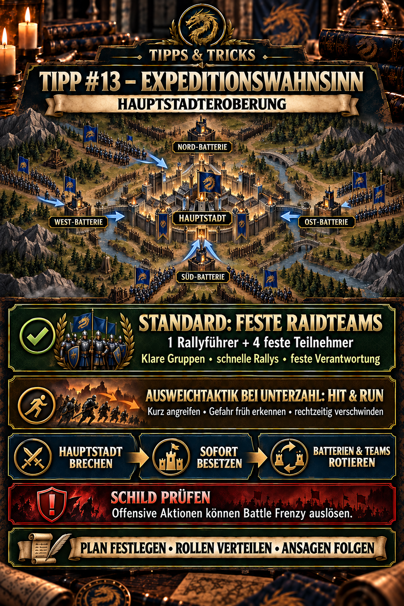

---
arten:
  - Anleitung
  - Strategie
themen:
  - Events
  - Kampf
  - Allianz
  - Weltkarte
---

# 💡 Tipp #13 – Expeditionswahnsinn: Hauptstadteroberung

## Das Wichtigste in Kürze

- Von Sonntag bis Freitag entscheiden die gemeinsam gesammelten **Kriegszonenpunkte**, welcher Server am Samstag angreift und welcher verteidigt.
- In der Kampfphase zählt das gemeinsame Serverziel: Die Angreifer müssen die gegnerische Hauptstadt erobern, die Verteidiger müssen das verhindern.
- Die vier **Batterien** rund um die Hauptstadt sind keine Nebenziele. Kontrollierte und gut besetzte Batterien setzen gegnerische Truppen in der Hauptstadt unter Druck.
- Den **maximalen Effekt** erzielt eine Allianz mit festen Raidteams: ein verantwortlicher Rallyführer, vier fest zugeordnete Teilnehmer sowie vorbereitete Ziele, Signale und Ersatzspieler.
- Auch unkoordinierter zusammengestellte Sammelangriffe können stark sein und Erfolg haben. Sie brauchen meist länger, reagieren langsamer und liefern weniger zuverlässig das optimale Ergebnis.
- Wenn eine kleine Allianz keine tragfähigen Raidteams stellen oder ein Objektiv nicht halten kann, ist **Hit & Run** eine bewusste Ausweichtaktik: kurz angreifen und sich vor einer überlegenen Gegenreaktion rechtzeitig verlagern.
- Keine unkoordinierten Einzelangriffe auf die Hauptstadt. Nach einem Wechsel werden beschädigte Teams geheilt, neu geordnet und erst auf Ansage wieder eingesetzt.
- Offensive Aktionen wie Angreifen, Auskundschaften oder die Teilnahme an einem Angriff können den Schild beenden und **Battle Frenzy** auslösen. Prüft den aktuellen Hinweis vor jeder Aktion.
- Die Kampfphase dauert laut aktuellem DIE-Terminkalender höchstens vier Stunden und kann früher enden, sobald eine Seite **100 % Fortschritt** erreicht.

> **Merksatz:** Für maximalen Objektdruck feste Raidteams einsetzen; bei Unterzahl kontrolliert auf Hit & Run ausweichen.



## Wofür ist dieser Tipp?

Dieser Tipp erklärt die Hauptstadteroberung innerhalb des **Expeditionswahnsinns**. Das Ereignis ist ein serverübergreifender Kampf: Mehrere Allianzen desselben Servers verfolgen gemeinsam ein Ziel gegen den zugeteilten gegnerischen Server.

Die Seite soll drei häufige Probleme vermeiden:

1. Spieler verwechseln die Wochenwertung mit der eigentlichen Kampfphase.
2. Alle konzentrieren sich auf die Hauptstadt und lassen die Batterien unbesetzt.
3. Mitglieder greifen einzeln an, verlieren den Schild und verbrauchen Truppen, ohne den gemeinsamen Angriff zu unterstützen.
4. Kleine Allianzen versuchen eine nicht haltbare Position zu verteidigen, obwohl ein mobiler Hit-&-Run-Plan ihre Truppen besser erhalten würde.

Die hier beschriebene Hauptstadteroberung ist nicht mit einer gewöhnlichen Hauptstadteroberung innerhalb des eigenen Servers gleichzusetzen. Regeln, erlaubte Ziele und Zusammenarbeit können sich unterscheiden.

## Der Expeditionswahnsinn in drei Phasen

| Phase | Zeitraum | Bedeutung |
| --- | --- | --- |
| Kriegszonenwertung | Sonntag bis Freitag | Der Server sammelt gemeinsam Kriegszonenpunkte. |
| Auswertung | Freitag | Der punktstärkere Server wird Angreifer, der andere Verteidiger. |
| Hauptstadteroberung | Samstag | Beide Server kämpfen um Hauptstadt, Batterien und den Fortschrittsbalken. |

Kriegszonenpunkte und persönliche Punkte erfüllen unterschiedliche Zwecke:

- **Kriegszonenpunkte** bestimmen während der Woche Angriff und Verteidigung.
- **Persönliche Punkte** entstehen in der Kampfphase und sind für persönliche Belohnungen relevant.
- **Der Sieg des Servers** hängt am gemeinsamen Eroberungs- beziehungsweise Verteidigungsziel.

Wer nur seiner persönlichen Wertung hinterherläuft, kann dem Serverziel fehlen. Vor dem Kampf muss deshalb feststehen, ob ein Spieler für Hauptstadt, Batterie, Unterstützung oder eine andere freigegebene Aufgabe eingeplant ist.

## Hauptplan und Ausweichtaktik

Für die Hauptstadteroberung gibt es eine klare taktische Rangfolge. Der Objektivkampf mit festen Raidteams ist die beste Anwendung koordinierter Sammelangriffe und erzeugt den größten Einfluss auf Hauptstadt und Batterien. Nicht jede Allianz besitzt jedoch genügend starke und dauerhaft verfügbare Spieler, um diesen Plan vollständig umzusetzen.

| Ansatz | Ziel | Einordnung |
| --- | --- | --- |
| **Hauptplan – feste Raidteams** | Hauptstadt und Batterien mit vorbereiteten Fünfergruppen erobern, besetzen und rotieren | optimale Organisation für maximalen Effekt; benötigt klare Verantwortung und genügend aktive Teilnehmer |
| **Unkoordinierter Sammelangriff** | starke Einzel-Rallys mit gerade verfügbaren Mitgliedern bilden | weiterhin brauchbar, aber langsamer, fehleranfälliger und weniger zuverlässig als ein festes Raidteam |
| **Ausweichtaktik – Hit & Run** | kurze Angriffe durchführen, gegnerischer Übermacht ausweichen und eigene Truppen erhalten | sinnvoll, wenn Raidteams fehlen oder das Objektiv nicht dauerhaft gehalten werden kann |

Hit & Run ist damit nicht gleichwertig zum optimal organisierten Objektivkampf, sondern eine bewusste Alternative bei Unterzahl oder fehlender Aktivität. Es ist trotzdem kein ungeordneter Rückzug: Ziele, Abbruchsignale und Fluchtwege werden vorher festgelegt.

### Hit & Run als Ausweichtaktik für kleine Allianzen

Wenn ein dauerhaftes Halten unrealistisch ist, greift die Allianz nur klar ausgewählte Ziele an und bleibt beweglich. Sobald eine überlegene Gegenreaktion erkennbar wird, stehen zwei vorbereitete Rückzugswege zur Verfügung:

1. **Raubzug-Sprung:** Weil die Hauptstadteroberung mit dem Raubzug beziehungsweise Überfall des Allianz-Wettbewerbs zusammenfallen kann, lässt sich bei Gefahr über das Event auf den gegnerischen Server springen. Nach aktueller DIE-Erfahrung müssen Truppen außerhalb der Basis dafür nicht vorher zurückgerufen werden.
2. **Zufälliger Versetzer:** Wenn der Raubzug-Sprung nicht verfügbar ist, werden alle Truppen zur Basis zurückgerufen. Anschließend wird der zufällige Versetzer genutzt – unbedingt bevor der Kampf bereits läuft.

Die Grundlagen stehen in Tipp #10 – Hit & Run im PvP. Wie feste Fünfergruppen vorbereitet und geführt werden, erklärt Tipp #11 – Feste Raidteams im PvP. Tipp #12 – Kampfberichte richtig lesen hilft anschließend bei der Auswertung.

## Zeitplan richtig lesen

Die im Spiel genannten Zeiten beziehen sich auf die Serverzeit. Für die aktuellen Termine im September und Oktober 2026 führt der DIE-Kalender die Kampfphase beispielsweise von **16:00 bis 20:00 Uhr deutscher Zeit**. Diese lokale Uhrzeit darf nicht dauerhaft festgeschrieben werden: Zeitumstellungen und Spielupdates können die Umrechnung verändern.

Prüft deshalb vor jedem Termin:

1. Datum und Uhrzeit im DIE-Kalender,
2. Angreifer- oder Verteidigerstatus nach der Freitagsauswertung,
3. den Beginn des Zugangs zum gegnerischen Server,
4. den tatsächlichen Start der Kampfphase und
5. die aktuellen Siegbedingungen im Ereignisfenster.

Nach der derzeitigen Dokumentation endet die Kampfphase nach spätestens vier Stunden oder früher bei **100 % Fortschritt** einer Seite. Der aktuelle Ingame-Text ist für den konkreten Termin maßgeblich.

## Hauptstadt und Batterien

Im Zentrum steht die Hauptstadt. Rundherum liegen vier Batterien:

| Position auf der Karte | Bezeichnung |
| --- | --- |
| oben links | West |
| oben rechts | Nord |
| unten links | Süd |
| unten rechts | Ost |

Eine vom eigenen Server kontrollierte Batterie beschießt nach der öffentlich dokumentierten Mechanik gegnerische Teams, die sich in der Hauptstadt befinden. Die Batterie erobert die Hauptstadt nicht selbst, erschwert dem Gegner aber das dauerhafte Halten.

Das führt zu einer einfachen Priorität:

> **Die Hauptstadt entscheidet – die Batterien machen ihren Besitz haltbar oder unhaltbar.**

Ein Angriff ausschließlich auf die Hauptstadt kann deshalb scheitern, obwohl der erste Sammelangriff erfolgreich war. Bleiben die gegnerischen Batterien aktiv, werden die neuen Garnisonen weiter geschwächt. Umgekehrt nützt eine volle Batterie wenig, wenn niemand die Hauptstadt erobert oder verteidigt.

### Community-dokumentierte Batteriewerte

Der ausführliche Community-Leitfaden dokumentiert derzeit folgende Werte. Sie sind hilfreich für die Planung, wurden im DIE-Archiv aber noch nicht anhand eigener aktueller Screenshots unabhängig bestätigt:

| Garnisonierte Teams | dokumentierte Nachladezeit |
| ---: | ---: |
| 0–4 | 10 Sekunden |
| 5–9 | 9 Sekunden |
| 10–14 | 8 Sekunden |
| 15–19 | 7 Sekunden |
| 20 | 6 Sekunden |

Demnach senkt jedes fünfte Team die Nachladezeit um eine Sekunde; bei 20 Teams wäre das dokumentierte Minimum erreicht. Prüft vor dem Einsatz die aktuelle Kapazitäts- und Wirkungsbeschreibung im Spiel. Für die praktische Allianzplanung bleibt unabhängig von einzelnen Zahlen richtig: **Eine nur eroberte, aber kaum besetzte Batterie entfaltet weniger Druck als eine vollständig unterstützte.**

## Rollen für den Objektivplan festlegen

Die Bezeichnungen sind keine offiziellen Spielrollen. Sie beschreiben Aufgaben, die vor dem Start verteilt werden sollten.

### Einsatzleitung

Die Einsatzleitung beobachtet Karte und Fortschritt, setzt Markierungen und gibt frei:

- welches Ziel zuerst angegriffen wird,
- wer einen Sammelangriff startet,
- wann Hauptstadt oder Batterie verstärkt werden,
- wann beschädigte Teams rotieren und
- wann ein Ziel aufgegeben wird, um ein wichtigeres zu sichern.

Während eines laufenden Angriffs sollte nur eine kleine Zahl klar benannter Spieler Befehle geben.

### Hauptstadtgruppe

Hier stehen die stärksten und zuverlässig einsatzbereiten Teams. Ihre Aufgabe ist nicht, dauerhaft einzeln in die Hauptstadt zu laufen, sondern:

1. gegnerische Garnisonen durch abgestimmte Sammelangriffe zu entfernen,
2. nach erfolgreicher Eroberung schnell eigene Teams einzusetzen,
3. beschädigte Garnisonen rechtzeitig abzulösen und
4. einen gegnerischen Wechsel sofort mit einem vorbereiteten Gegenangriff zu beantworten.

Für maximale Wirkung arbeitet die Hauptstadtgruppe in festen Raidteams aus einem verantwortlichen Rallyführer und vier zugeordneten Teilnehmern. Ein Ersatzspieler wird möglichst vorab benannt. Wenn diese Struktur nicht vollständig möglich ist, kann die Allianz weiterhin starke Sammelangriffe mit den gerade verfügbaren Mitgliedern bilden; sie muss dann aber mehr Zeit für Aufruf, Teamprüfung und Nachbesetzung einplanen.

### Batteriegruppen

Für jede priorisierte Batterie sollte mindestens ein verantwortlicher Spieler oder eine feste Gruppe benannt sein. Batteriegruppen:

- erobern ihr zugewiesenes Ziel,
- melden starke gegnerische Garnisonen,
- füllen freie Plätze,
- rotieren beschädigte Teams und
- verlassen ihre Position nicht wegen eines entfernten Einzelziels.

Zwei stabil kontrollierte Batterien können ein sinnvolles Zwischenziel sein; vier kontrollierte Batterien erzeugen den größten gemeinsamen Druck. Welche Zahl im konkreten Kampf realistisch ist, entscheidet die Einsatzleitung anhand der Beteiligung und Gegnerstärke.

### Unterstützung und Positionssicherung

Auch schwächere Spieler können entscheidend beitragen:

- freigegebene Sammelangriffe vollständig füllen,
- Batterien mit noch verwendbaren Teams besetzen,
- Basen innerhalb der eigenen Allianz verstärken,
- Landeplätze und Zugänge in der Nähe wichtiger Spieler blockieren,
- Markierungen und Bewegungen des Gegners melden und
- zwischen den Angriffswellen Allianzhilfe für Heilungen geben.

Allianzübergreifende Zusammenarbeit auf demselben Server ist am gemeinsamen Ziel möglich. Nach der aktuellen Community-Dokumentation können Mitglieder jedoch weiterhin nicht den Sammelangriff einer anderen Allianz füllen und keine fremde Allianz-Basis verstärken. Plant Rallys und Basisschutz deshalb innerhalb der eigenen Allianz.

## Vorbereitung vor dem Kampf

### Am Freitag

- Angreifer- oder Verteidigerstatus prüfen.
- Objektivkampf mit festen Raidteams als Hauptplan prüfen; bei fehlender Stärke oder Aktivität Hit & Run als Ausweichtaktik festlegen.
- Einsatzleitung, Rallyführer, vier feste Teilnehmer und Ersatzspieler je Raidteam benennen.
- Hauptstadt- und Batteriegruppen einteilen.
- Teilnahme und ungefähre Onlinezeit abfragen.
- Markierungen, Chatkanal und kurze Befehle festlegen.
- Den Mitgliedern erklären, welche persönlichen Aktionen dem Serverziel untergeordnet werden sollen.

### Vor dem Zugang

- Hauptteam, Truppenstärke und Marschplätze kontrollieren.
- Krankenhaus leeren und Kapazität prüfen.
- Heilungs-, Marsch- und Versetzerressourcen bereithalten.
- Aktive Kampfboni und ihre Laufzeit prüfen.
- Einen Schutzschild nur mit dem Wissen aktivieren, dass offensive Aktionen ihn beenden können.
- Tipp #8 zur schnellen Heilung noch einmal öffnen und ausreichend Helfer organisieren.

### Vor dem Kampfbeginn

- Zugewiesene Position einnehmen.
- Nicht ohne Freigabe auskundschaften oder angreifen.
- Prüfen, welcher Spieler welchen Sammelangriff eröffnet.
- Batterie- und Hauptstadtsymbole eindeutig benennen, damit Nord, Süd, Ost und West nicht verwechselt werden.
- Erste Ersatzteams und die Reihenfolge für Rotationen festlegen.

## Angriffsplan für den angreifenden Server

### 1. Positionen sichern

Die Angreifer sollten die verfügbare Zugangs- und Positionierungsphase nutzen. Kurze Marschwege und freie Landeplätze neben starken Spielern sind im späteren Kampf wertvoll.

### 2. Gemeinsames Eröffnungsziel festlegen

Die Einsatzleitung entscheidet vor dem Start, ob zuerst eine bestimmte Batterie, mehrere Batterien oder direkt die Hauptstadt angegriffen werden. Der Plan muss zur tatsächlichen Stärke und Teilnehmerzahl passen.

### 3. Garnisonen mit Sammelangriffen brechen

Einzelangriffe auf eine starke Hauptstadtgarnison verteilen Verwundete, verraten Positionen und lösen möglicherweise Battle Frenzy aus. Der Rallyführer startet, seine vier fest zugeordneten Teilnehmer füllen sofort mit den freigegebenen Teams und alle anderen warten auf das Ergebnis. Fehlt ein Mitglied, rückt der vorher benannte Ersatz nach. Ohne feste Raidteams bleibt ein starker Sammelangriff möglich, benötigt aber eine längere Sammel- und Prüfphase.

### 4. Nach der Eroberung sofort besetzen

Ein erfolgreicher Angriff ist nur der Wechselpunkt. Direkt danach müssen frische Teams in das Ziel, während beschädigte Teams zurückkehren und heilen.

### 5. Batterien parallel stabilisieren

Während die Hauptstadtgruppe arbeitet, halten die Batteriegruppen den gegnerischen Beschuss niedrig und erhöhen den eigenen Druck. Schwächere Teams können hier taktisch wertvoller sein als bei einem unkoordinierten Angriff auf die Hauptstadt.

## Verteidigungsplan für den verteidigenden Server

### 1. Gute Positionen früh besetzen

Verteidiger kennen das Zielgebiet. Starke Spieler und zugeordnete Unterstützer sollten die wichtigsten Plätze vor Beginn belegen, statt erst nach dem ersten Angriff anzureisen.

### 2. Hauptstadt nicht isoliert betrachten

Eine starke Hauptstadtgarnison ohne Batteriekontrolle wird dauerhaft beschossen. Batterieverteidigung ist deshalb Teil der Hauptstadtverteidigung.

### 3. Ersatzgarnisonen bereithalten

Nach einem gegnerischen Sammelangriff muss sofort klar sein, wer ausgefallene oder beschädigte Teams ersetzt. Frische Teams dürfen nicht erst gesucht werden, wenn die Hauptstadt bereits leer ist.

### 4. Gegenangriffe koordinieren

Nimmt der Gegner ein Ziel ein, sind seine beteiligten Teams häufig bereits beschädigt. Ein vorbereiteter Gegenangriff nutzt dieses kurze Fenster besser als mehrere verspätete Einzelangriffe.

## Schild und Battle Frenzy

Nach der aktuellen Community-Dokumentation gelten folgende Grundregeln:

| Aktion | dokumentierte Folge für den Schild |
| --- | --- |
| Hauptstadt, Batterie oder Basis angreifen | Schild endet; Battle Frenzy |
| einem offensiven Sammelangriff beitreten | Schild endet; Battle Frenzy |
| ein Ziel auskundschaften | Schild endet; Battle Frenzy |
| inaktiv eine Position halten | Schild bleibt möglich |
| Basis eines Mitglieds der eigenen Allianz verstärken | Schild bleibt möglich |

Battle Frenzy wird dort mit **15 Minuten** angegeben und verhindert währenddessen einen neuen Schild. Die DIE-Termine weisen ebenfalls auf 15 Minuten hin. Prüft dennoch die aktuelle Warnmeldung vor jeder Aktion, weil Spielupdates oder Sonderregeln einzelne Fälle verändern können.

> **Sicherheitsregel:** Wer unter Schild unterstützen soll, greift nicht „nur kurz“ an und kundschaftet auch nicht eigenmächtig aus.

## Rotieren, heilen und wieder einsetzen

Ein Team bleibt nach einem gewonnenen Kampf nicht automatisch frisch. Der verbleibende Truppenstand entscheidet, ob es weiterhalten kann.

Ein sauberer Kreislauf sieht so aus:

`kämpfen → Ziel besetzen → Beschädigung beobachten → ablösen → zurückkehren → in kleinen Blöcken heilen → neu einsetzen`

Dabei helfen drei Regeln:

1. **Nicht bis zum vollständigen Zusammenbruch warten.** Ein rechtzeitiger Wechsel erhält die Einsatzfähigkeit.
2. **Ablösung vor Rückzug organisieren.** Erst wenn ein Ersatzteam unterwegs oder angekommen ist, verlässt das beschädigte Team die Garnison.
3. **Heilung gemeinsam beschleunigen.** Kleine Heilblöcke und aktive Allianzhilfe bringen Teams schneller zurück; siehe Tipp #8.

## Serverziel und persönliche Punkte bewusst planen

Die Hauptstadteroberung bietet persönliche Wertungen, doch nicht jede punktreiche Aktion hilft im gleichen Maß beim Sieg. Im optimalen Objektivplan fehlt ein fest zugeteilter Spieler am entscheidenden Sammelangriff, wenn er ein entferntes Einzelziel verfolgt. Bei einer ausdrücklich angeordneten Hit-&-Run-Ausweichtaktik können mobile Einzelziele dagegen vorgesehen sein.

Vor dem Kampf sollte deshalb festgelegt werden:

- welche Spieler ausschließlich das Serverziel unterstützen,
- welche Spieler den mobilen Hit-&-Run-Plan übernehmen,
- wann persönliche Punkte gesammelt werden dürfen,
- welche Ziele ausdrücklich nicht angegriffen werden und
- wann alle Spieler zur Hauptstadt zurückkehren müssen.

Persönliche Belohnungen sind sinnvoll. Entscheidend ist, dass der Objektivplan Vorrang hat, solange die Allianz tragfähige Raidteams dafür aufstellt. Eine Hit-&-Run-Gruppe wird nur bewusst getrennt eingeplant und darf keine fest zugesagten Rallyteilnehmer binden.

## Typische Fehler

- **Wochenwertung und Kampfphase verwechseln:** Kriegszonenpunkte bestimmen Angriff und Verteidigung; sie ersetzen nicht den Kampf am Samstag.
- **Nur die Hauptstadt beachten:** Ohne Batterien kann eine gerade eroberte Garnison schnell unter Druck geraten.
- **Einzeln in starke Garnisonen laufen:** Das erzeugt Verluste, ohne einen abgestimmten Wechsel zu sichern.
- **Nach der Eroberung nicht nachbesetzen:** Ein leeres oder schwach gefülltes Ziel geht sofort wieder verloren.
- **Alle starken Spieler gleichzeitig verbrauchen:** Es fehlt eine frische Gruppe für den Gegenangriff.
- **Beschädigte Teams zu lange halten:** Rechtzeitige Rotation ist besser als ein vollständiger Ausfall.
- **Schild versehentlich verlieren:** Auch Auskundschaften oder Rallyteilnahme können als offensive Aktion zählen.
- **Andere Allianzen falsch einplanen:** Gemeinsames Ziel bedeutet nicht automatisch, dass fremde Rallys oder Basen unterstützt werden können.
- **Persönlichen Punkten hinterherlaufen:** Die Serverentscheidung fällt an Hauptstadt und Batterien.
- **Eine nicht haltbare Stellung erzwingen:** Kleine Allianzen dürfen bewusst Hit & Run wählen, statt ihre gesamten Truppen am Objektiv zu verbrauchen.
- **Feste Uhrzeiten für immer übernehmen:** Serverzeit, deutsche Zeit und Zeitumstellung müssen für jeden Termin neu geprüft werden.

## Kompakte Einsatzcheckliste

### Vor dem Start

- [ ] Angriff oder Verteidigung bestätigt
- [ ] feste Raidteams für den Objektivkampf eingeteilt oder Hit & Run bewusst als Ausweichtaktik gewählt
- [ ] aktuelle Uhrzeit und Zugangsphase geprüft
- [ ] Einsatzleitung, Rallyführer, vier Teilnehmer und Ersatzspieler je Raidteam benannt
- [ ] Hauptstadt- und Batteriegruppen verteilt
- [ ] Krankenhaus, Truppen, Marschplätze und Versetzer vorbereitet
- [ ] Schild- und Battle-Frenzy-Regeln gelesen
- [ ] Markierungen und Chatbefehle vereinbart

### Während des Kampfes

- [ ] Objektivplan priorisieren; Hit & Run nur bei entsprechender Einteilung durchführen
- [ ] Rallys vollständig und mit passenden Teams füllen
- [ ] Hauptstadt nach erfolgreichem Angriff sofort besetzen
- [ ] Batterien nicht leer stehen lassen
- [ ] beschädigte Teams rechtzeitig ablösen
- [ ] in kleinen Blöcken heilen und Allianzhilfe geben
- [ ] Fortschritt und gegnerische Bewegungen melden

## Grenzen und offene Punkte

Für mehrere Detailwerte liegt noch kein eigener aktueller DIE-Ingame-Beleg vor. Dazu gehören insbesondere:

- die exakte Berechnung des Fortschrittsbalkens,
- die Batterie-Nachladezeiten und ihre aktuelle Staffelung,
- Schaden und Behandlung der durch Batterien getroffenen Soldaten,
- die vollständigen persönlichen Punktwerte,
- mögliche Unterschiede zwischen einzelnen Expeditionsrunden sowie
- Änderungen durch spätere Updates.

Die Strategie trennt deshalb zwischen stabilen Grundsätzen – koordinierte Rallys, Hauptstadt plus Batterien, Rollen und Rotation – und versionsabhängigen Zahlen. Bei Widersprüchen gilt immer die aktuelle Ingame-Beschreibung.

## Quellen und Verlässlichkeit

- **DIE-Termine und Einsatzgrundlage:** [Hauptstadteroberung am 26.09.2026](https://github.com/Anthlan/zroute_die/blob/main/Termine/2026_09_26_Hauptstadteroberung.md) – Angreifer-/Verteidigerlogik, Zeitfenster, 100-%-Fortschritt, Aufgabenverteilung und Battle Frenzy.
- **Ausführliche Community-Dokumentation:** [Expedition Frenzy – Zroute Unofficial](https://zroutegame.com/expedition-frenzy/) – Phasen, Serverzeit, Zusammenarbeit, Batteriepositionen und -werte, persönliche Wertung sowie Rollen. Die Quelle kennzeichnet zahlreiche offene oder nur aus Screenshots abgelesene Angaben selbst.
- **Versionshinweise:** [Z Route Academy – Updates](https://zroute.dev/updates/) – dokumentiert unter anderem die visuelle Überarbeitung des Expeditionswahnsinns sowie spätere Änderungen bei Rückreise, Markierungen und Belohnungen.
- **Verwandte DIE-Tipps:** Tipp #2 zu Sammelangriffen, Tipp #4 zum Teleportieren, Tipp #8 zur schnellen Heilung, Tipp #9 zum kostenlosen Raubzug-Sprung, Tipp #10 zu Hit & Run, Tipp #11 zu festen Raidteams und Tipp #12 zum Lesen von Kampfberichten.

**Stand:** 27.09.2026

## Allianz-Mitteilung zum Kopieren

```html
<color=#FFD700><b>💡 TIPP #13 – EXPEDITIONSWAHNSINN</b></color>

Bei der <b>Hauptstadteroberung</b> hat der koordinierte Objektivkampf Vorrang:

🏰 <b>HAUPTPLAN – FESTE RAIDTEAMS:</b> 1 Rallyführer + 4 feste Teilnehmer. Hauptstadt nur auf Ansage angreifen, danach sofort besetzen, Batterien füllen und beschädigte Teams ablösen.

⚡ <b>AUSWEICHTAKTIK – HIT & RUN:</b> Wenn wir kein Objektiv halten können: kurze Angriffe, Gefahr früh erkennen und rechtzeitig per Raubzug-Sprung oder Versetzer verschwinden.

🤝 <b>WICHTIG:</b> Feste Verantwortung bringt den maximalen Effekt. Spontane starke Rallys gehen auch, brauchen aber mehr Zeit und sind weniger zuverlässig.

🛡️ <color=#FF4040><b>ACHTUNG:</b></color> Angriff, Auskundschaften oder Rallyteilnahme können den Schild beenden und 15 Minuten Battle Frenzy auslösen.

<color=#7FFF00><b>Raidteams zuerst – Hit & Run, wenn Halten nicht realistisch ist!</b></color>
```
